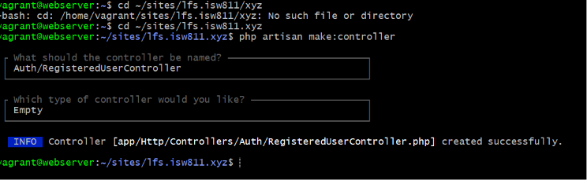
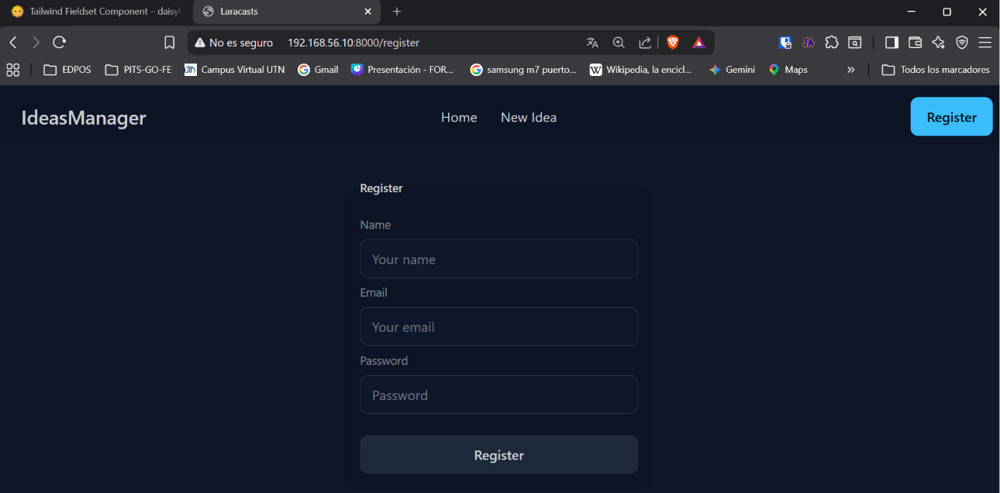
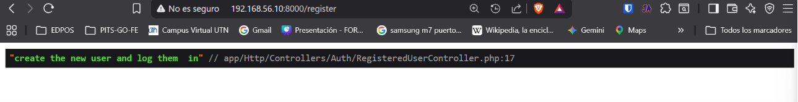
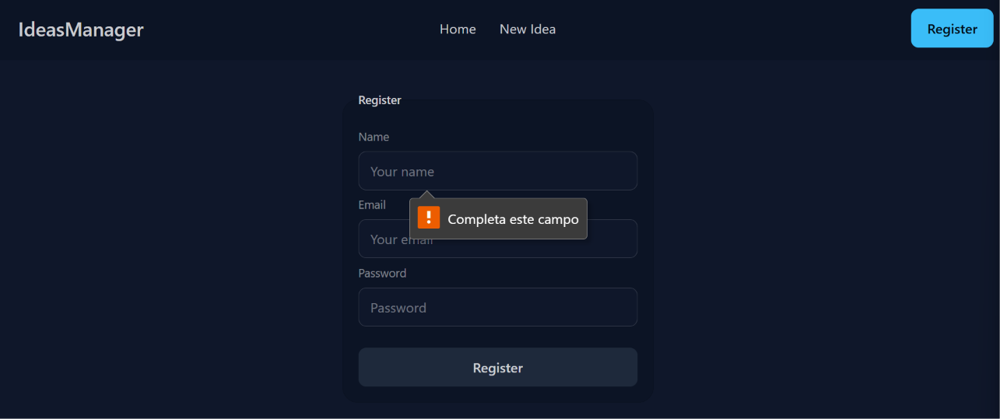
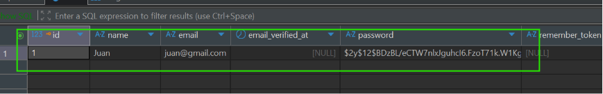
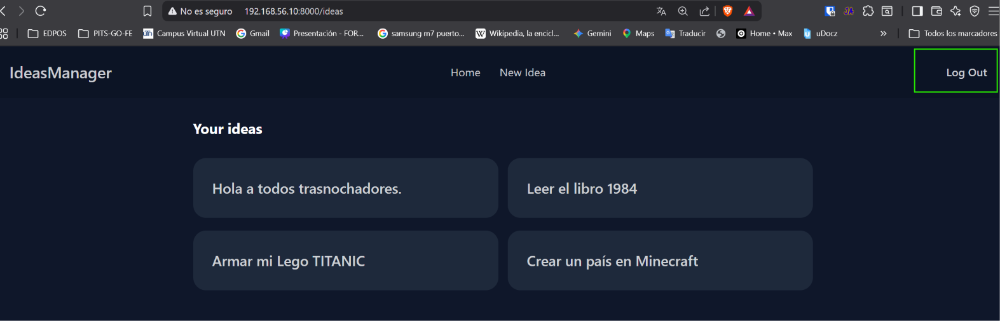
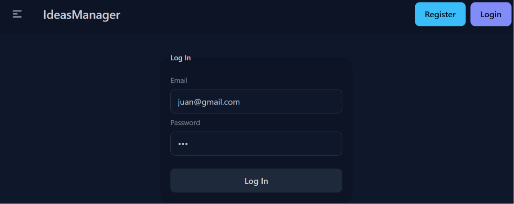

[< Volver al índice](../entregable01.md)

# Episodio 14: Authentication Explained

En este episodio implementé el sistema de autenticación de la aplicación desde cero, registro de usuarios, inicio de sesion y cierre de sesión.

## Registro de usuarios

Creé el controlador con:

```bash
php artisan make:controller Auth/RegisteredUserController
```

Organizándolo dentro de una subcarpeta `Auth/`, convención que separa los controladores de autenticación del resto de la aplicación. El método `store` valida los datos, crea el usuario, hashea la contraseña, y lo loguea automáticamente:

```php
public function store(Request $request)
{
    $request->validate([
        'name' => ['required', 'string', 'max:255'],
        'email' => ['required', 'string', 'email', 'max:255', 'unique:users'],
        'password' => ['required', Password::defaults()],
    ]);

    $user = User::create([
        'name' => $request->name,
        'email' => $request->email,
        'password' => Hash::make($request->password),
    ]);

    Auth::login($user);

    return redirect('/ideas');
}
```

`Hash::make()` se usa porque Laravel no guarda contraseñas en texto plano, sino que usa n hash bcrypt por defecto. La regla `unique:users` evita registrar dos cuentas con el mismo correo, y `Password::defaults()` aplica las reglas de seguridad configuradas globalmente para contraseñas.

## Inicio de sesión

Para el login, creé un controlador distinto, `SessionsController`, ya que conceptualmente no se trata de un recurso CRUD tradicional sino de manejar el estado de la sesión:

```php
public function store(Request $request)
{
    $validated = $request->validate([
        'email' => ['required', 'string', 'email', 'max:255'],
        'password' => ['required', 'string', Password::defaults()],
    ]);

    if (Auth::attempt($validated)) {
        $request->session()->regenerate();
        return redirect('/ideas');
    }

    return back()->withErrors([
        'email' => 'The provided credentials do not match our records.',
    ]);
}
```

`Auth::attempt()` compara internamente el password ingresado contra el hash guardado, sin que yo tenga que comparar nada manualmente. `session()->regenerate()` genera un nuevo identificador de sesión tras un login exitoso, una medida de seguridad estándar contra ataques de fijación de sesión.

## Cierre de sesión

El logout simplemente llama a `Auth::logout()`:

```php
public function destroy()
{
    Auth::logout();
    return redirect('/ideas');
}
```

Como los formularios HTML no soportan el verbo `DELETE` de forma nativa, usé `@method('DELETE')` igual que ya había hecho antes para eliminar ideas.

## Navbar dinámico según el estado de autenticación

Para mostrar distintas opciones según si hay alguien logueado o no, usé la directiva `@auth` con su alternativa `@else`:

```php
@auth
    <form method="POST" action="/logout">
        @csrf
        @method('DELETE')
        <button class="btn btn-ghost">Log Out</button>
    </form>
@else
    <a class="btn btn-primary" href="/register">Register</a>
    <a class="btn btn-secondary" href="/login">Log In</a>
@endauth
```

## Rutas

```php
Route::get('/register', [RegisteredUserController::class, 'create']);
Route::post('/register', [RegisteredUserController::class, 'store']);

Route::get('/login', [SessionsController::class, 'create']);
Route::post('/login', [SessionsController::class, 'store']);
Route::delete('/logout', [SessionsController::class, 'destroy']);
```

## Evidencia
















<sub>Documentado por Xavier Fernández Zúñiga - ISW-811</sub>