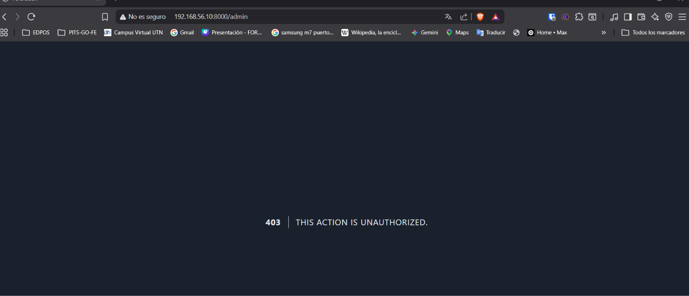
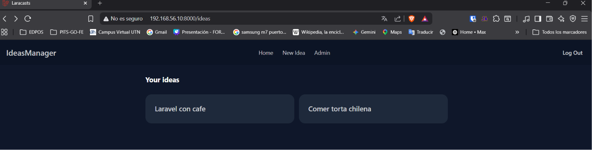
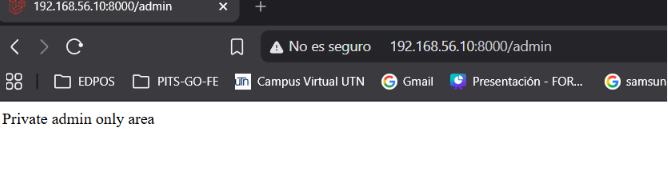

[< Volver al índice](../entregable02.md)

# Episodio 17: Authorization Using Gates

En este episodio implementé mi primera regla de autorización usando Gates de Laravel, para restringir el acceso a una ruta administrativa según si el usuario autenticado es considerado administrador.

## Definir el Gate

Registré la regla `view-admin` dentro de `AppServiceProvider`, en el método `boot()`:

```php
use App\Models\User;
use Illuminate\Auth\Access\Response;
use Illuminate\Support\Facades\Gate;

public function boot(): void
{
    Gate::define('view-admin', function (?User $user) {
        return $user->isAdmin() ? Response::allow() : Response::denyAsNotFound();
    });
}
```

El parámetro `?User $user` acepta `null`, porque un Gate puede evaluarse incluso para visitantes no autenticados. `Response::denyAsNotFound()` es una forma particular de denegar en vez de devolver un 403 (que revela que la ruta existe pero está restringida), devuelve un 404, ocultando completamente la existencia del área administrativa a quien no tiene permiso.

Para mantener la lógica de "quien es administrador" dentro del modelo en vez de hardcodearla en el Gate, agregué un método a `User`:

```php
public function isAdmin(): bool
{
    return $this->id == 1;
}
```

## Proteger la ruta

```php
Route::get('/admin', function () {
    Gate::authorize('view-admin');
    return 'Private admin only area';
});
```

`Gate::authorize()` lanza automaticamente una excepción de autorización si la regla no se cumple, que Laravel convierte en la respuesta HTTP correspondiente (404 en este caso, por el `denyAsNotFound()`).

## Mostrar UI condicional

En el navbar, usé la directiva `@can` para mostrar el link "Admin" solo si el usuario actual pasa la misma regla:

```php
@can('view-admin')
    <li><a href="/admin">Admin</a></li>
@endcan
```

Esto reutiiza exactamente el mismo Gate tanto para proteger la ruta como para decidir qué mostrar en la interfaz, evitando duplicar la lógica de "quién puede ver esto".

## Evidencia








<sub>Documentado por Xavier Fernández Zúñiga - ISW-811</sub>