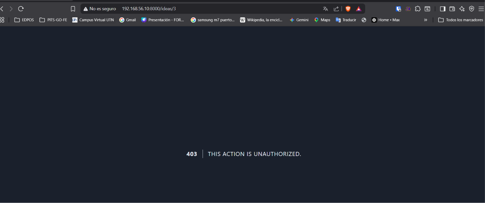
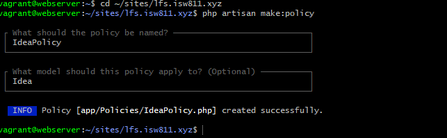

[< Volver al índice](../entregable02.md)

# Episodio 18: Authorization Using Policies

En este episodio reemplacé la verificación manual de propiedad de una idea por una Policy de Laravel agrupando la lógica de autorización específica del modelo `Idea` en una clase dedicada.

## Crear la Policy

```bash
php artisan make:policy IdeaPolicy
```

Esto genera `app/Policies/IdeaPolicy.php` con métodos placeholder para las acciones típicas de un recurso (`viewAny`, `view`, `create`, `update`, `delete`, `restore`, `forceDelete`). Elimine los que no necesitaba y dejé únicamente `update`, ya que decidí que la misma regla ("ser el dueño de la idea") debía aplicar tanto para ver, como para editar y eliminar:

```php
public function update(User $user, Idea $idea): Response|bool
{
    return $user->is($idea->user);
}
```

`$user->is($idea->user)` compara si el usuario autenticado es el mismo que el dueno de la idea (usando la relación `belongsTo` definida en el episodio anterior), de forma más expresiva que comparar manualmente `$user->id === $idea->user_id`.

## Aplicar la Policy en el controlador

```php
use Illuminate\Support\Facades\Gate;

public function show(Idea $idea)
{
    Gate::authorize('update', $idea);
    return view('ideas.show', ['idea' => $idea]);
}

public function update(IdeaRequest $request, Idea $idea)
{
    Gate::authorize('update', $idea);
    $idea->update(['description' => request('description')]);
    return redirect('/ideas/' . $idea->id);
}

public function destroy(Idea $idea)
{
    Gate::authorize('update', $idea);
    $idea->delete();
    return redirect('/ideas');
}
```

Uns ventaja importante frente a los Gates del episodio anterior: Laravel detecta automaticamente qué Policy usar según el modelo que se le pase a `Gate::authorize()`, gracias a la convención de nombres (`Idea` → `IdeaPolicy`), sin necesidad de registrar nada manualmente en `AppServiceProvider`. Por eso pude eliminar por completo el código de Gates que había escrito en el episodio anterior.
## Evidencia





<sub>Documentado por Xavier Fernández Zúñiga - ISW-811</sub>