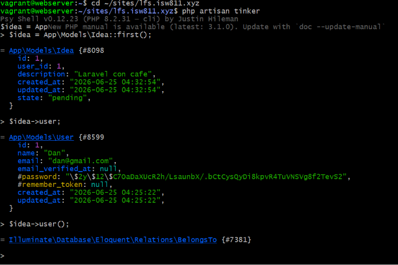
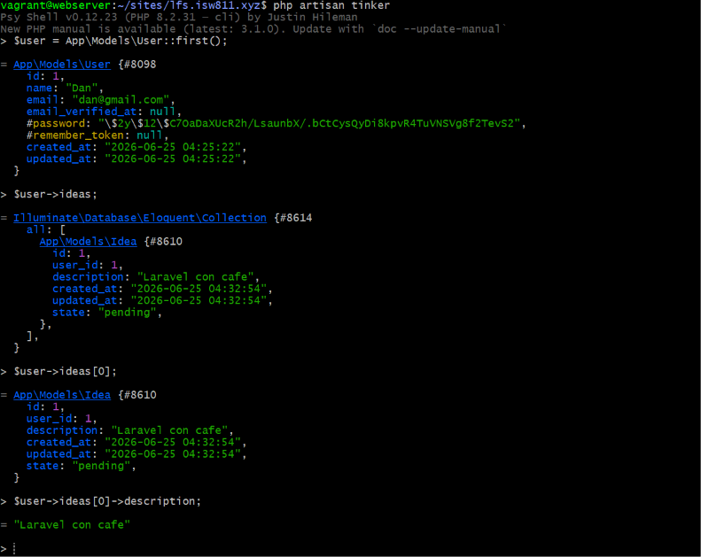
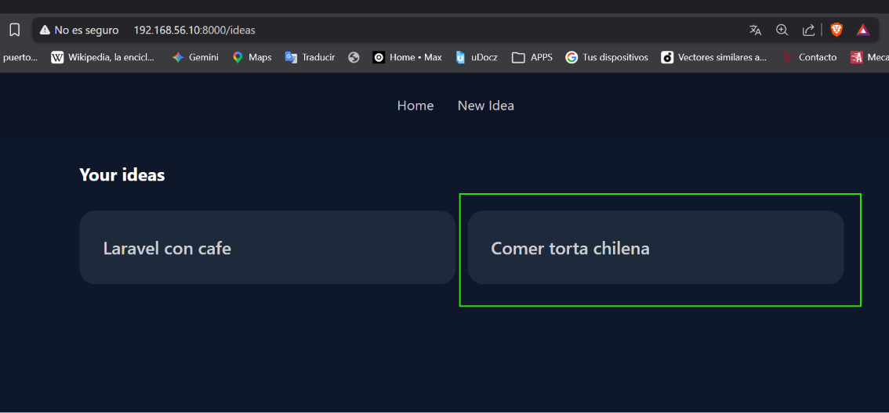
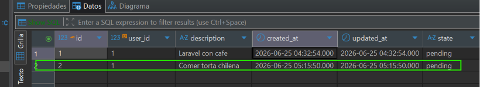

[< Volver al índice](../entregable01.md)

# Episodio 16: Eloquent Relationships

En este último episodio del entregable formalicé la relación entre ideas y usuarios usando los métodos de relación de Eloquent, reemplazando las consultas manuales por una sintaxis mas expresiva basada en esa relación.

## Definir la relación en ambos sentidos

En el modelo `Idea`, cada idea pertenece a un usuario:

```php
use Illuminate\Database\Eloquent\Relations\BelongsTo;

class Idea extends Model
{
    protected $guarded = [];

    public function user(): BelongsTo
    {
        return $this->belongsTo(User::class);
    }
}
```

Y en el modelo `User`, agregué la relación inversa: un usuario tiene muchas ideas:

```php
use Illuminate\Database\Eloquent\Relations\HasMany;

class User extends Authenticatable
{
    public function ideas(): HasMany
    {
        return $this->hasMany(Idea::class);
    }
}
```

Probé ambas relaciones en Tinker para confrmar que funcionaban antes de usarlas en el controlador:

```bash
php artisan tinker
```
```php
$idea = App\Models\Idea::first();
$idea->user;          // trae el usuario dueño de esa idea

$user = App\Models\User::first();
$user->ideas;          // trae todas las ideas de ese usuario
```

## Usar las relaciones en el controlador

Reemplacé el filrado manual con `where('user_id', Auth::id())` por la relación directa:

```php
public function index()
{
    return view('ideas.index', [
        'ideas' => Auth::user()->ideas,
    ]);
}
```

Y al crear una idea, en vez de pasar `user_id` manualmente, usé la relación para que Eloquent lo complete automáticamente:

```php
public function store(IdeaRequest $request)
{
    Auth::user()->ideas()->create([
        'description' => request('description'),
        'state' => 'pending',
    ]);

    return redirect('/ideas');
}
```

Al llamar `->create()` directamente sobre la relacin `ideas()` de un usuario, Eloquent asocia automáticamente esa nueva idea con el `user_id` correspondiente, sin que yo tenga que especificarlo a mano.

## Anotación para el editor

Agregué un bloque PHPDoc sobre la clase `User` para que el editor reconozca correctamente el tipo de la propiedad `$ideas` evitando falsos avisos de propiedad no encontrada:

```php
/**
 * @property-read \Illuminate\Database\Eloquent\Collection<int, \App\Models\Idea> $ideas
 */
class User extends Authenticatable
```

## Evidencia










<sub>Documentado por Xavier Fernández Zúñiga - ISW-811</sub>