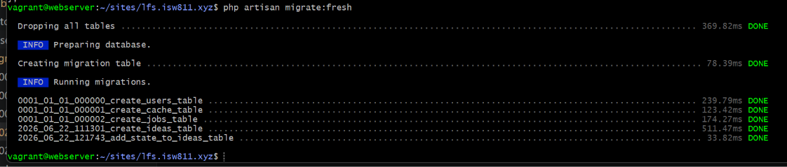
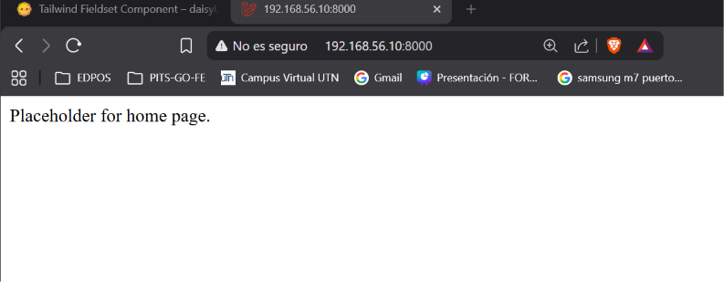
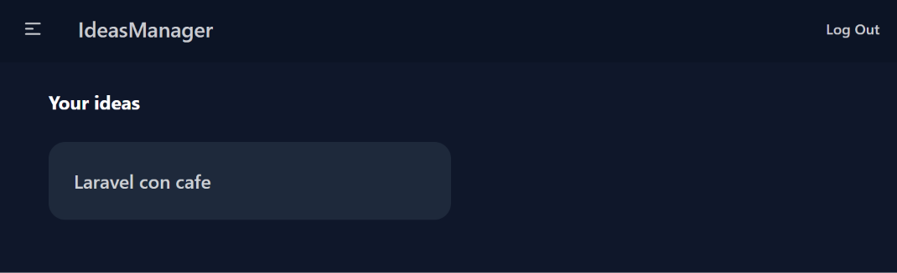
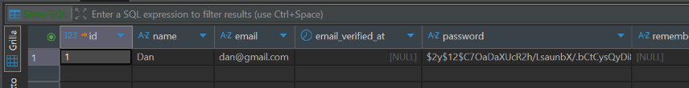
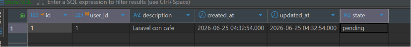

[< Volver al índice](../entregable01.md)

# Episodio 15: Require Authentication With Middleware

En este episodio protegí las rutas de la aplicación usando middleware, asocié cada idea con el usuario que la crea, y filtré el listado para que cada usuario vea únicamente sus propias ideas.

## Relación entre ideas y usuarios

Agregué una clave foránea `user_id` a la tabla `ideas` mediante una migración:

```php
use App\Models\User;

Schema::create('ideas', function (Blueprint $table) {
    $table->id();
    $table->foreignIdFor(User::class)->constrained()->cascadeOnDelete();
    $table->text('description');
    $table->timestamps();
});
```

`foreignIdFor()` crea la columna `user_id` automáticamente, `constrained()` agrega la restricción de clave foránea hacia la tabla `users`, y `cascadeOnDelete()` hace que, si se elimina un usuario, todas sus ideas se eliminen en cascada.

## Renombrar la base de datos

Tuve que renombrar mi base de datos de `lfs.isw811.xyz` a `lfs_isw811_xyz`, reemplazando los puntos por guiones bajos. MariaDB usa el punto como separador entre esquema y tabla, así que un nombre de base con puntos rompía comandos como `migrate:fresh`, que intentan eliminar varias tablas en una sola sentencia.

## Protección de rutas con middleware

Agrupé las rutas según si requieren autenticación o no:

```php
Route::middleware('auth')->group(function () {
    Route::get('/ideas', [IdeaController::class, 'index']);
    Route::get('/ideas/create', [IdeaController::class, 'create']);
    Route::post('/ideas', [IdeaController::class, 'store']);
    Route::get('/ideas/{idea}', [IdeaController::class, 'show']);
    Route::get('/ideas/{idea}/edit', [IdeaController::class, 'edit']);
    Route::patch('/ideas/{idea}/edit', [IdeaController::class, 'update']);
    Route::delete('/ideas/{idea}', [IdeaController::class, 'destroy']);
    Route::delete('/logout', [SessionsController::class, 'destroy']);
});

Route::middleware('guest')->group(function () {
    Route::get('/register', [RegisteredUserController::class, 'create']);
    Route::post('/register', [RegisteredUserController::class, 'store']);
    Route::get('/login', [SessionsController::class, 'create'])->name('login');
    Route::post('/login', [SessionsController::class, 'store']);
});
```

Las rutas de ideas requieren estar autenticado; las de registro y login requieren lo contrario (un usuario ya logueado no debería poder volver a registrarse o loguearse). Configuré también a dónde redirigir a un visitante no autenticado que intenta acceder a una ruta protegida:

```php
->withMiddleware(function (Middleware $middleware): void {
    $middleware->redirectGuestsTo('/login');
})
```

## Asociar ideas con su creador

En el controlador, cada idea nueva se asocia automáticamente con el usuario autenticado:

```php
Idea::create([
    'description' => request('description'),
    'state' => 'pending',
    'user_id' => Auth::id(),
]);
```

Y el listado se filtra para mostrar solo las ideas del usuario actual:

```php
public function index()
{
    $ideas = Idea::query()->where('user_id', Auth::id())->get();
    return view('ideas/index', ['ideas' => $ideas]);
}
```

## Evidencia











<sub>Documentado por Xavier Fernández Zúñiga - ISW-811</sub>