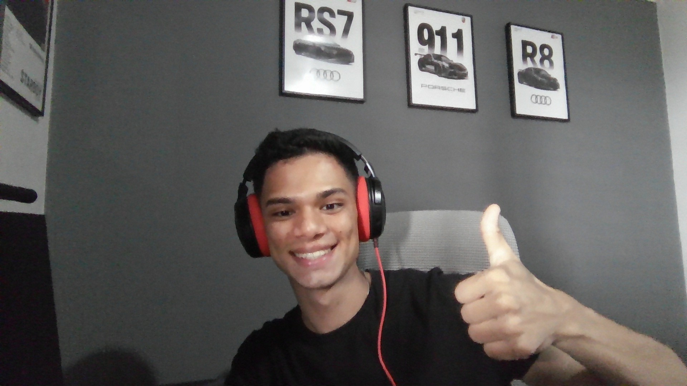

[< Volver al índice](./entregable03.md)

<table border="0">
  <tr>
    <td>
      <strong>Universidad Técnica Nacional</strong> 
      ISW-811 Aplicaciones Web – Software Libre 
      <strong>Docente:</strong> Misael Matamoros Soto 
      <strong>Estudiante:</strong> Xavier Fernández Zúñiga 
      <strong>Fecha de entrega:</strong> 15 de julio de 2026
    </td>
    <td align="right">
      
    </td>
  </tr>
</table>

# Conclusiones del Proyecto

## Principales aprendizajes

A lo largo de este entregable, ademas de reforzar Laravel (Eloquent, migraciones, Form Requests, Policies, Actions Classes) y AlpineJS para interactividad sin recargar la página, me llevo algunos aprendizajes que he tenido en mi block de notitas.

- **La diferencia entre el nombre de un campo de formulario y el nombre real de una columna de base de datos.** Varios errores del proyecto (`steps`, `image`) vinieron de asumir que `$request->validated()` podía insertarse directamente cuando en realidad ciertos campos necesitaban transformarse antes de persistirse (por ejemplo, `image` → `image_path`, o `steps` moviéndose a su propia tabla relacionada).
- **Cómo funciona realmente la inyección de dependencias de Laravel.** Entender por qué `new CreateIdea` no disparaba el atributo `#[CurrentUser]`, pero `app(CreateIdea::class)` sí, me obligó a comprender el contenedor de servicios en profundidad en vez de solo copiar patrones.
- **Las convenciones de Eloquent no siempre son intuitivas a primera vista** — como el hecho de que un accessor declarado en camelCase (`formattedDescription()`) se accede como propiedad en snake_case (`formatted_description`), algo que no lanza ningún error si se hace mal, solo devuelve `null` silenciosamente.
## Dificultades encontradas y soluciones aplicadas

- **Configuración de red (DNS) en la VM**: al intentar instalar `alpinejs` vía npm, la VM no podía resolver `registry.npmjs.org` porque `/etc/resolv.conf` apuntaba a un nameserver inválido. Solución: forzar `nameserver 8.8.8.8`.
- **Imports faltantes recurrentes**: en casi todos los controladores y Action Classes nuevos (`IdeaController`, `StepController`, `StoreIdeaRequest`, `ProfileController`, `UpdateIdea`), faltaban uno o más `use` statements que a veces por seguir a Jefrey se me olvidaba agregar, porque el simplemente daba click y le aparecia pero a mi no quizás por usar VS Code. Aprendí a revisar esto como primer paso de diagnóstico ante cualquier "Class not found".
- **Assets de Tailwind no compilados**: múliples veces agregué clases nuevas de Tailwind (`max-w-2xl`, `rotate-45`, `size-5`, clases del plugin de tipografía) sin correr `npm run build`, lo que hacía que el navegador mostrara estilos viejos o incompletos. Terminé internalizando la regla: cualquier cambio en JS/CSS o clase nueva de Tailwind requiere recompilar.
- **Componentes Blade que no propagaban atributos**: el ícono `<x-icons.close>` tenía su clase hardcodeada (`class="size-4"`) sin usar `{{ $attributes }}`, lo que hacía que cualquier clase adicional pasada desde afuera (como `rotate-45`) se perdiera silenciosamente.
- **Variables no capturadas en closures de PHP**: en `UpdateIdea::handle()`, el closure de `DB::transaction()` no incluía `$idea` en su `use (...)`, causando un error de variable indefinida.

## Funcionalidades que me parecieron más relevantes

- El sistema de **modales reutilizables con AlpineJS**, que terminó unificando el formulario de creación y edición de ideas en un solo componente (`x-idea.modal`), evitando duplicar markup.
- La **carga y gestión de imágenes destacadas**, incluyendo su eliminación independiente mediante un controlador dedicado (`IdeaImageController`).
- El **refactor a Action Classes** (`CreateIdea`, `UpdateIdea`), que dejó los controladores mucho más limpios y con responsabilidad única.
- El sistema de **autorización con Policies** (`IdeaPolicy`), que impide que un usuario acceda, edite o elimine ideas que no le pertenecen.
- El soporte de **Markdown en la descripción de una idea**, usando un accessor de Eloquent y el plugin de tipografía de Tailwind, como ejercicio de implementar una "feature request" de punta a punta.

## Posibles mejoras futuras

- Implementar **soporte de equipos** (sugerido por Jeffrey Way en el episodio final), permitiendo que varios usuarios colaboren sobre las mismas ideas con niveles de autorización distintos entre sí.
- Actualizar el entorno a **PHP 8.3+** para poder usar `pestphp/pest-plugin-browser` y ejecutar los tests de nvegador originales del curso, en vez de mantener únicamente sus versiones adaptadas a Feature testing, con l oque no quise agarrarme durante la ejecucón del proyecto por miedo a generar problemas y complicaciones innecesarias.
- Agregar **paginación** a la lista de ieas, que actualmente carga todas las ideas del usuario sin límite.
- Sincronizar los `steps` en la edición de idea por `id` en vez de borrar y recrear todos en cada actualización, preservando así su fecha real de creación.
- Explorar **Inertia.js**, como sugirió Jeffrey Way, para evolucionar el proyecto hacia una experiencia mas dinámica sin abandonar el enrutamiento del lado del servidor que ya domino.

## Cierre

Completar este entregable significó resolver errores, investigar como resolverlos y seguir a Jefrey durante su implementación, que me parece fue muy buena. Me gustó mucho la metodología de este proyecto ya que fue muy intuitivo con las pautas del profe Misa, y fue interesante a la vez practicar la comprensión del Inglés, que es algo que me encanta. 

Documentado por Xavier Fernández Zúñiga - ISW-811