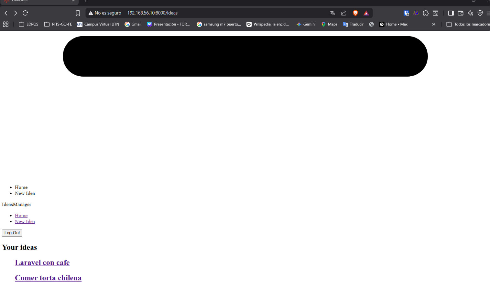
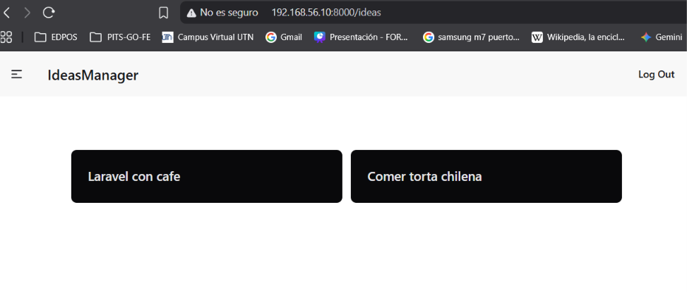

[< Volver al índice](../entregable02.md)

# Episodio 19: Frontend Asset Bundling with Vite

En este episodio reemplacé los CDN de Tailwind y DaisyUI que venía usando desde el episodio de DaisyUI Detour por una compilación local de assets usando Vite, que es la herramienta de bundling que Laravel incluye por defecto desde la versión 9.

## Cambios en el layout

Eliminé los tres tags del CDN y los reemplacé por la directiva de Blade que conecta con Vite:

```php
{{-- Antes --}}
<link href="https://cdn.jsdelivr.net/npm/daisyui@5" rel="stylesheet" type="text/css" />
<script src="https://cdn.jsdelivr.net/npm/@tailwindcss/browser@4"></script>
<link href="https://cdn.jsdelivr.net/npm/daisyui@5/themes.css" rel="stylesheet" type="text/css" />

{{-- Después --}}
@vite(['resources/css/app.css', 'resources/js/app.js'])
```

Segun comprendi con el curso `@vite()` le dice a Laravel que archivos fuente compilar. En desarrollo apunta al servidor de Vite con hot-reload; en producción apunta a los archivos estaticos compilados en `public/build/`.

## Configuración de assets

Instalé daisyUI y el plugin de tailwind para Vite como dependencias de desarrollo:

```bash
npm i -D daisyui@latest
npm i -D @tailwindcss/vite
```

El archivo `app.css` define la configuración de Tailwind, daisyUI y el tema:

```css
@import 'tailwindcss';

@source '../views/**/*.blade.php';
@source '../js/**/*.js';

@plugin "daisyui" {
    theme: dracula
}

@theme {
    --font-sans: 'Instrument Sans', ui-sans-serif, system-ui, sans-serif, 'Apple Color Emoji', 'Segoe UI Emoji',
        'Segoe UI Symbol', 'Noto Color Emoji';
    --color-primary: oklch(65% 0.25 300);
}
```

Las directivas `@source` le dicen a Tailwind dónde buscar clases para incluirlas en el bundle final — solo las clases que realmente usa el proyecto terminan en el CSS compilado.

El archivo `vite.config.js` configura el plugin de Laravel y Tailwind, con host `0.0.0.0` para que el servidor de desarrollo sea accesible desde fuera de la VM:

```javascript
import { defineConfig } from 'vite';
import laravel from 'laravel-vite-plugin';
import tailwindcss from '@tailwindcss/vite';

export default defineConfig({
    plugins: [
        laravel({
            input: ['resources/css/app.css', 'resources/js/app.js'],
            refresh: true,
        }),
        tailwindcss(),
    ],
    server: {
        host: '0.0.0.0',
        port: 5173,
        watch: {
            ignored: ['**/storage/framework/views/**'],
        },
    },
});
```

## Compilar los assets

Para desarrollo con hot-reload:

```bash
npm run dev
```

Para producción (genera archivos estáticos en `public/build/`):

```bash
npm run build
```

## Evidencia





## Problema encontrado

Tuve un problema con mi entorno al correr `npm run dev`, el navegador en Windows bloqueaba la carga de los assets de Vite con el error `(blocked:other)`, porque el servidor de Vite dentro de la VM no era accesible directamente desde el host. Lo resolví de dos formas primero agregando `host: '0.0.0.0'` al `vite.config.js` para que vite escuchra todas las interfaces, y usando `npm run build` en vez de `npm run dev`, que genera archivos estaticos tal como Jefrey explicó tambien.

También tuve que ajustar las rutas `@source` en `app.css`: las rutas originales del video usaban paths relativos que no coincidían con mi estructura de carpetas, lo que hacía que Tailwind no detectara las clases usadas en los Blade y generara un CSS vacío. Finalmente logré resolverlo y funcionó correctamente.

<sub>Documentado por Xavier Fernández Zúñiga - ISW-811</sub>