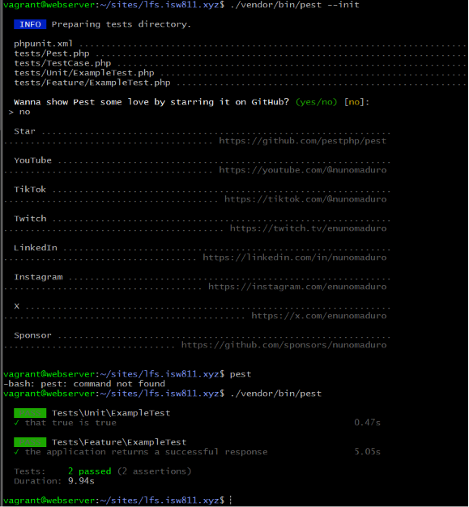

[< Volver al índice](../entregable02.md)

# Episodio 22: How to Get Started Testing Your Code

En este episodio reemplacé PHPUnit por Pest como framework de testing del proyecto, instalé sus dependencias y exploré la creación de tests de feature y de browser testing.

## Instalando Pest

Quité PHPUnit e instalé Pest como dependencia de desarrollo:

```bash
composer remove phpunit/phpunit
composer require pestphp/pest --dev --with-all-dependencies
./vendor/bin/pest --init
```

Mi VM corre PHP 8.2.31, y la última versión de Pest (v4) requiere PHP `^8.3`, así que Composer instaló automáticamente una versión compatible más antigua, Pest `^3.8`. El comando `--init` creó el archivo `Pest.php` en la raíz del proyecto y verificó que la instalación funcionara corriendo el test de ejemplo.

Para correr los tests usé:

```bash
./vendor/bin/pest
```

Aprendí que, a diferencia de otros comandos artisan, Pest no se invoca de forma global sino a través de `vendor/bin/`, ya que se instala como dependencia del proyecto y no globalmente en el sistema.

## Browser testing con Pest y Playwright

Jefrey mostro como agregar tests de browser testing reales usando un plugin de Pest con Playwright:

```bash
composer require pestphp/pest-plugin-browser --dev
npm install playwright@latest
npx playwright install
```

En mi caso no pude instalar `pestphp/pest-plugin-browser` porque su única versión disponible requiere PHP `^8.3`, mientras mi VM corre PHP 8.2.31. Aun así, Playwright (que es independiente de PHP) se instaló correctamente vía npm.

Configuré la carpeta de tests de browser siguiendo la estructura del video:

```php
pest()->extend(Tests\TestCase::class)
    ->use(Illuminate\Foundation\Testing\RefreshDatabase::class)
    ->in('Browser');
```

Y agregué al `.gitignore`:
/tests/Browser/Screenshots

## El modelo Idea con estado por defecto

Actualicé `app/Models/Idea.php` para que las ideas nuevas tengan un estado por defecto sin necesidad de especificarlo manualmente en el controlador:

```php
class Idea extends Model
{
    protected $guarded = [];

    protected $attributes = [
        'state' => 'pending',
    ];

    public function user(): BelongsTo
    {
        return $this->belongsTo(User::class);
    }
}
```

## Tests creados (no ejecutables en mi ambiente)

Documenté el código de los dos tests del video aunque no pude ejecutarlos por la limitación de PHP:

`tests/Feature/IdeaTest.php`:

```php
use App\Models\User;

it('shows all ideas', function () {
    $this->actingAs($user = User::factory()->create());

    $user->ideas()->create([
        'description' => 'Build a thing',
    ]);

    visit('/ideas')
        ->assertSee('Build a thing');
});

it('shows a single idea', function () {
    //
});

it('shows an edit form to update an idea', function () {
    //
});
```

`tests/Browser/AuthTest.php`:

```php
use App\Models\User;

it('registers a user', function () {
    visit('/register')
        ->fill('name', 'Jane Doe')
        ->fill('email', 'jane@example.com')
        ->fill('password', 'password123!@')
        ->press('Register');

    expect(User::where('email', 'jane@example.com')->exists())->toBe(true);
    $this->assertAuthenticated();
});
```

## Evidencia



## Problema encontrado

Intenté ejecutar el test de browser testing del Episodio 22 (`tests/Browser/ExampleTest.php`, con la función `visit('/')`) y enfrenté una cadena de errores relacionados:

Primero, `composer require pestphp/pest-plugin-browser --dev` falló porque la única versión disponible del plugin requiere PHP `^8.3`, y mi VM corre PHP 8.2.31.

Como prueba, instalé Playwright vía npm de todas formas (no depende de PHP) y corrí el test sin el plugin de Pest instalado. Esto reveló un segundo error, faltaba la extensión `pdo_sqlite` de PHP, necesaria para `RefreshDatabase` en la base de datos de prueba en memoria. Lo resolví instalando la extensión

```bash
sudo apt-get install -y php8.2-sqlite3
sudo systemctl restart apache2
```

Con eso resuelto  el test avanzó más, pero finalmente falló con `Call to undefined function visit()`, confirmando que la causa raíz era la ausencia del plugin de browser testing, no un problema de configuración del sistema. Preferi documentar esta limitación en lugar de forzar una actualización de PHP en la vm,que podría afectar el resto del proyecto.

<sub>Documentado por Xavier Fernández Zúñiga - ISW-811</sub>