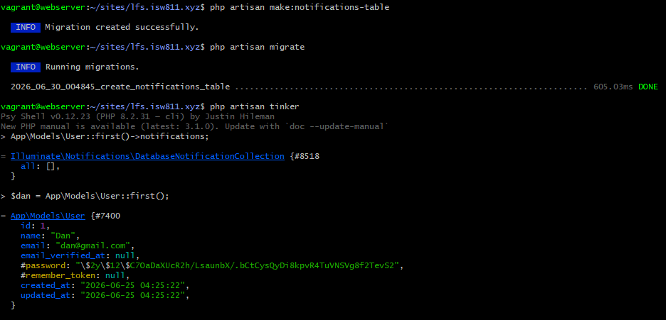
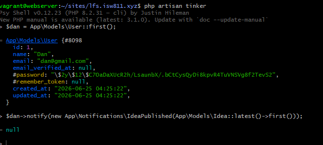
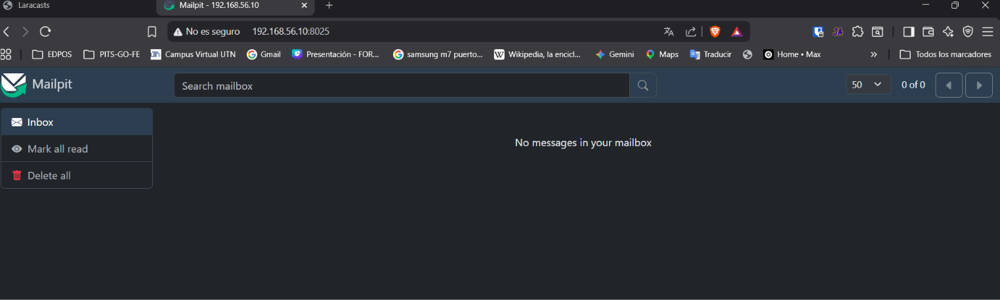
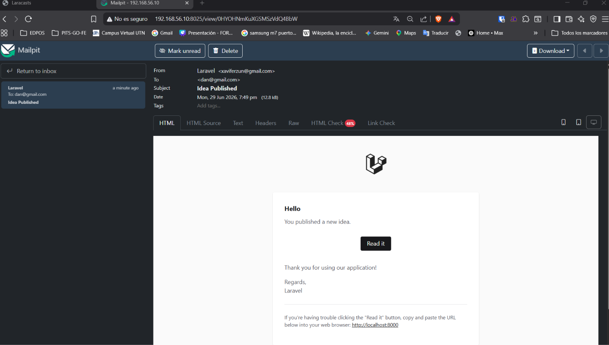

[< Volver al índice](../entregable02.md)

# Episodio 20: Notifications

En este episodio vi el sistema de notificaciones de Laravel, que permite enviar mensajes a los usuarios a través de email, base de datos, SMS, etc usando una API.

## El trait Notifiable y RoutesNotifications

Seguí a Jefrey en la revision de `RoutesNotifications`, ubicado en `vendor/laravel/framework/src/Illuminate/Notifications/RoutesNotifications.php`. Este archivo le da al modelo `User` tres métodos clave:

- `notify($instance)`: envía una notificación, pudiendo ir a una cola.
- `notifyNow($instance, $channels)`: envía la notificación de forma inmediata, sin cola.
- `routeNotificationFor($driver, $notification)`: decide a dónde se enruta la notificación según el canal. Si el canal es `database`, usa `$this->notifications()`; si es `mail`, usa `$this->email`.

También revisé `HasDatabaseNotifications`, que es el trait que le da al modelo acceso a:

- `notifications()`: todas las notificaciones.
- `readNotifications()`: solo las leídas.
- `unreadNotifications()`: solo las no leídas.

Antes de poder usar el canal `database`, hice la migracion:

```bash
php artisan notifications:table
php artisan migrate
```

Esto creó la tabla `notifications` con la siguiente estructura:

```php
Schema::create('notifications', function (Blueprint $table) {
    $table->uuid('id')->primary();
    $table->string('type');
    $table->morphs('notifiable');
    $table->text('data');
    $table->timestamp('read_at')->nullable();
    $table->timestamps();
});
```

Verifiqué que funcionaba con Tinker:

```php
App\Models\User::first()->notifications;
// = Illuminate\Notifications\DatabaseNotificationCollection { all: [] }
```

## Creando la notificación IdeaPublished

Generé una clase de notificación con:

```bash
php artisan make:notification IdeaPublished
```

Esto creó `app/Notifications/IdeaPublished.php`. La modifiqué para que reciba una instancia de `Idea` en el constructor y construya un correo personalizado:

```php
namespace App\Notifications;

use App\Models\Idea;
use Illuminate\Bus\Queueable;
use Illuminate\Notifications\Messages\MailMessage;
use Illuminate\Notifications\Notification;

class IdeaPublished extends Notification
{
    use Queueable;

    public function __construct(protected Idea $idea)
    {
        //
    }

    public function via(object $notifiable): array
    {
        return ['mail'];
    }

    public function toMail(object $notifiable): MailMessage
    {
        $url = url('/ideas/'.$this->idea->id);

        return (new MailMessage)
            ->greeting('Hello')
            ->line('You published a new idea.')
            ->line($this->idea->description)
            ->action('Read it', url('/'))
            ->line('Thank you for using our application!');
    }

    public function toArray(object $notifiable): array
    {
        return [
            //
        ];
    }
}
```


## Configurando Mailpit como cliente SMTP 

Instalé **Mailpit** en la VM:

```bash
sudo bash -c "$(curl -sSL https://raw.githubusercontent.com/axllent/mailpit/develop/install.sh)"
mailpit --listen 0.0.0.0:8025 --smtp 0.0.0.0:1025
```

Configuré el `.env` para enrutar el correo a Mailpit en lugar del log:

```env
MAIL_MAILER=smtp
MAIL_HOST=127.0.0.1
MAIL_PORT=1025
```

También corregí `APP_URL`, que estaba apuntando a `localhost:8000` (lo cual no es accesible desde Windows hacia la VM):

```env
APP_URL=http://192.168.56.10:8000
```

Con eso, probé el envío completo desde tinker:

```php
$dan = App\Models\User::first();
$dan->notify(new App\Notifications\IdeaPublished(App\Models\Idea::latest()->first()));
// = null (éxito)
```

Y pude ver el correo recibido en la interfaz web de Mailpit, accesible en `http://192.168.56.10:8025`.

## Evidencia










<sub>Documentado por Xavier Fernández Zúñiga - ISW-811</sub>