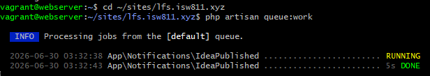
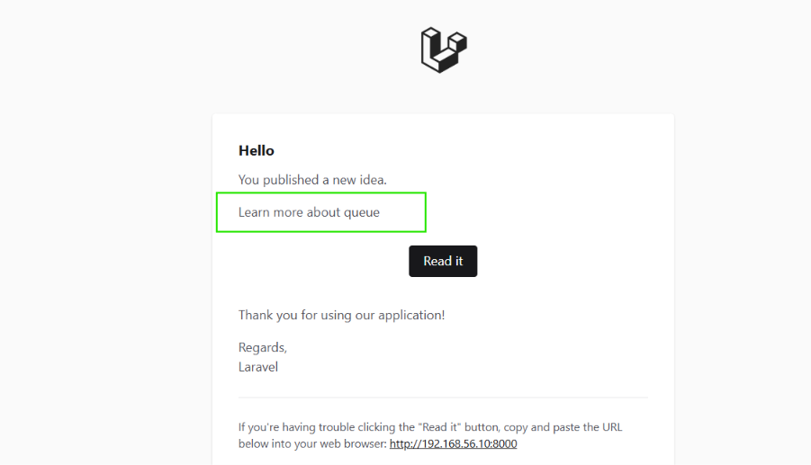

[< Volver al índice](../entregable02.md)

# Episodio 21: When to Queue it Up

En este episodio aprendí sobre el sistema de colas (queues) de Laravel y cómo decidir qué tareas conviene encolar en lugar de ejecutar de forma síncrona dentro de una petición HTTP.

## El problema que resuelven las colas

Cuando agregué `implements ShouldQueue` a la clase `IdeaPublished`, la notificación dejó de enviarse de forma inmediata y pasó a encolarse:

```php
use Illuminate\Contracts\Queue\ShouldQueue;

class IdeaPublished extends Notification implements ShouldQueue
{
    use Queueable;
    // ...
}
```

Esto significa que en lugar de bloquear la petición del usuario mientras se envía el correo, Laravel guarda un registro del trabajo pendiente en la tabla `jobs` de la base de datos (driver `database`, configurado por defecto en `QUEUE_CONNECTION`) y lo procesa de forma asíncrona.

## El worker de colas

Para que los jobs encolados realmente se ejecuten, hace falta un proceso corriendo en segundo plano que los vaya tomando uno por uno:

```bash
php artisan queue:work
```

Mientras corre, muestra el estado de cada trabajo procesado:
INFO  Processing jobs from the [default] queue.
2026-06-30 03:27:02 App\Notifications\IdeaPublished ........................ RUNNING
2026-06-30 03:27:03 App\Notifications\IdeaPublished .................. 542.52ms DONE

Aprendí que este comando se queda corriendo en primer plano, igual que `php artisan serve` o `mailpit`, así que necesits una terminal dedicada para él además de las que ya tenía abiertas.

## Creando un Job personalizado

Generé un Job nuevo para simular una tarea pesada que no debería bloquear al usuario, como actualizar estadísticas:

```bash
php artisan make:job UpdateIdeaStatistics
```

Esto creó `app/Jobs/UpdateIdeaStatistics.php`:

```php
namespace App\Jobs;

use Illuminate\Contracts\Queue\ShouldQueue;
use Illuminate\Foundation\Queue\Queueable;

class UpdateIdeaStatistics implements ShouldQueue
{
    use Queueable;

    public function __construct()
    {
        //
    }

    public function handle(): void
    {
        logger('The UpdateJobStatistics job is being processed.');
    }
}
```

Todo Job, igual que las notificaciones encoladas, implementa `ShouldQueue` y define su lógica dentro de `handle()`, que es el método que ejecuta el worker cuando le toca el turno a ese trabajo.

También revisé la tabla `jobs` en DBeaver para entender cómo Laravel almacena los trabajos pendientes mientras esperan a ser procesados y confirm que una vez que el worker completa un job, el registro se elimina de esa tabla automáticamente.

## Evidencia





<sub>Documentado por Xavier Fernández Zúñiga - ISW-811</sub>