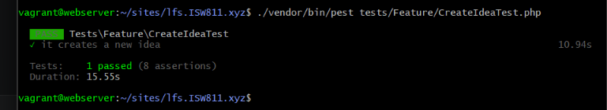

[< Volver al índice](../entregable03.md)

# Episodio 37 - Action Classes

En este episodio refactoricé la lógica de creación de ideas, moviéndola desde el controlador hacia una clase de acción dedicada (`CreateIdea`) siguiendo la explicacion del profesor Jefrey.

## Creación de la Action Class

Extraje toda la lógica que antes vivía en `IdeaController::store()` hacia una nueva clase en `app/Actions/CreateIdea.php`:

```php
class CreateIdea
{
    public function handle(array $attributes, ?User $user = null)
    {
        $user ??= Auth::user();

        $data = collect($attributes)->only([
            'title', 'description', 'status', 'links',
        ])->toArray();

        if ($attributes['image'] ?? false) {
            $data['image_path'] = $attributes['image']->store('ideas', 'public');
        }

        DB::transaction(function () use ($user, $data, $attributes) {
            $idea = $user->ideas()->create($data);

            $steps = collect($attributes['steps'] ?? [])->map(fn ($step) => [
                'description' => $step
            ]);

            $idea->steps()->createMany($steps);
        });
    }
}
```

El controlador quedó reducido a una sola línea:

```php
public function store(StoreIdeaRequest $request)
{
    app(CreateIdea::class)->handle($request->safe()->all());

    return to_route('idea.index')->with('success', 'Idea created successfully.');
}
```

## Inyección del usuario actual con atributos de PHP

Jefrey explico esto al final y quise probarlo, en vez de pasar el usuario como argumento del método `handle()` con un valor por defecto (`?User $user = null`), lo declaré como dependencia del constructor de la clase, usando el atributo nativo de Laravel `#[CurrentUser]`:

```php
class CreateIdea
{
    public function __construct(#[CurrentUser] protected ?User $user)
    {
    }

    public function handle(array $attributes)
    {
        $data = collect($attributes)->only([
            'title', 'description', 'status', 'links',
        ])->toArray();

        if ($attributes['image'] ?? false) {
            $data['image_path'] = $attributes['image']->store('ideas', 'public');
        }

        DB::transaction(function () use ($data, $attributes) {
            $idea = $this->user->ideas()->create($data);

            $steps = collect($attributes['steps'] ?? [])->map(fn ($step) => [
                'description' => $step
            ]);

            $idea->steps()->createMany($steps);
        });
    }
}
```


## Evidencia




<sub>Documentado por Xavier Fernández Zúñiga - ISW-811</sub>