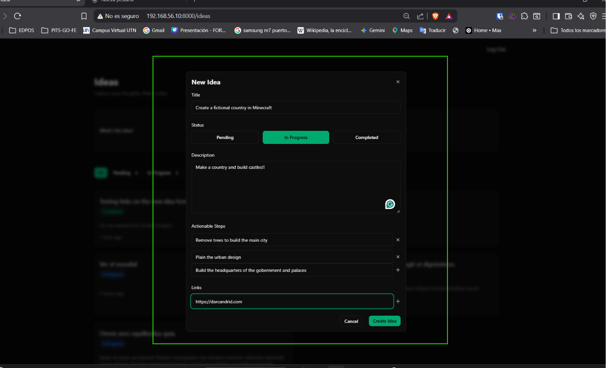
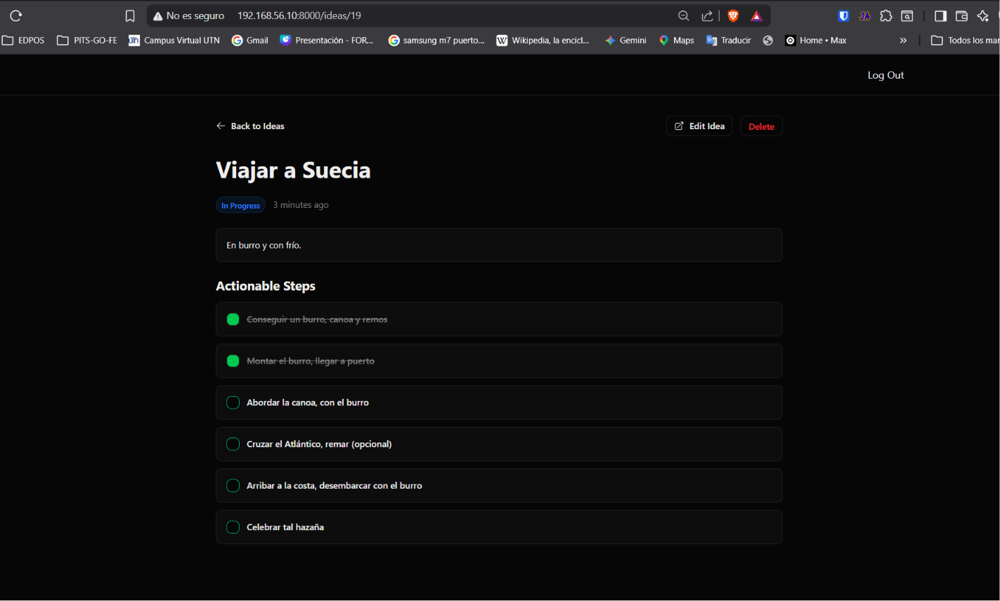

[< Volver al índice](../entregable03.md)

# Episodio 35 - Actionable Steps

En este episodio agregué pasos accionables tipo checkboxes a una idea, siguiendo el mismo patrón de los links, pero esta vez los pasos se guardan en su propia tabla relacionada, no como columna JSON de la idea. También implementé la funcionalidad para marcar cada paso como completado.

## Modelo y migración de `Step`

Creé el modelo `Step` con su relación inversa hacia `Idea`:

```php
class Step extends Model
{
    use HasFactory;

    public function idea(): BelongsTo
    {
        return $this->belongsTo(Idea::class);
    }
}
```

Y la migración correspondiente:

```php
Schema::create('steps', function (Blueprint $table) {
    $table->id();
    $table->foreignIdFor(Idea::class)->constrained()->cascadeOnDelete();
    $table->string('description');
    $table->boolean('completed')->default(false);
    $table->timestamps();
});
```

Agregué la relación `hasMany` en el modelo `Idea`:

```php
public function steps(): HasMany
{
    return $this->hasMany(Step::class);
}
```

## Campo de Steps en el formulario (`index.blade.php`)

Siguiendo el mismo patrón que el bloque de Links, agregué un `<template x-for>` para listar los steps ya agregados, más un input y botón para ir sumando nuevos:

```blade
<div>
    <fieldset class="space-y-3">
        <legend class="label">Actionable Steps</legend>

        <template x-for="(step, index) in steps">
            <div class="flex gap-x-2 items-center">
                <input name="steps[]" x-model="step" class="input" readonly>

                <button
                    type="button"
                    aria-label="Remove step"
                    @click="steps.splice(index, 1)"
                    class="form-muted-icon"
                >
                    <x-icons.close />
                </button>
            </div>
        </template>
    </fieldset>

    <div class="flex gap-x-2 items-center">
        <input
            x-model="newStep"
            type="text"
            id="new-step"
            data-test="new-step"
            placeholder="What's the next step?"
            class="input flex-1"
            spellcheck="false"
        >

        <button
            type="button"
            @click="steps.push(newStep.trim()); newStep = '';"
            data-test="submit-new-step-button"
            :disabled="newStep.trim().length === 0"
            aria-label="Add a new step"
            class="form-muted-icon"
        >
            <x-icons.close class="rotate-45" />
        </button>
    </div>
</div>
```

Amplié el `x-data` del formulario para incluir `steps` y `newStep`, y corregí el status inicial (me había quedado apuntando a un valor de enum inexistente):

```blade
x-data="{
    status: @js(App\IdeaStatus::PENDING->value),
    links: [],
    newLink: '',
    steps: [],
    newStep: '',
}"
```

## Validación (`StoreIdeaRequest`)

```php
'steps' => ['nullable', 'array'],
'steps.*' => ['string', 'max:255'],
```

## Guardar los steps al crear la idea (`IdeaController`)


```php
public function store(StoreIdeaRequest $request)
{
    $idea = Auth::user()->ideas()->create($request->safe()->except('steps'));

    foreach ($request->validated('steps', []) as $step) {
        $idea->steps()->create(['description' => $step]);
    }

    return to_route('idea.index')->with('success', 'Idea created successfully.');
}
```

## Marcar un step como completado

En `show.blade.php`, cada step se muestra dentro de su propio mini-formulario con un botón que actúa como checkbox visual:

```blade
<form method="POST" action="{{ route('step.update', $step) }}">
    @csrf
    @method('PATCH')

    <div class="flex items-center gap-x-3">
        <button type="submit" role="checkbox" class="size-5 flex items-center justify-center rounded-lg border border-input bg-background hover:bg-accent hover:text-accent-foreground {{$step->completed ? 'bg-green-500 text-white' : 'border border-primary'}}"></button>
        <span class="{{ $step->completed ? 'text-muted-foreground line-through' : 'text-foreground' }}">{{ $step->description }}</span>
    </div>
</form>
```

Y en el `StepController`, aprovechando route model binding:

```php
class StepController extends Controller
{
    public function update(Request $request, Step $step)
    {
        // authorization

        $step->update(['completed' => !$step->completed]);

        return back();
    }
}
```

Con la ruta:
```php
Route::patch('/steps/{step}', [StepController::class, 'update'])->name('step.update')->middleware('auth');
```

## Evidencia





## Problema encontrado

Tuve varios errores:

1. **`IdeaStatus::DRAFT` inexistente**: el `x-data` inicial del formulario apuntaba a un valor de enum (`DRAFT`) que no existe entre mis casos (`PENDING`, `IN_PROGRESS`, `COMPLETED`), lo que causaba un error fatal al renderizar toda la página. Lo corregí apuntando a `PENDING`.

2. **Bloque de Actionable Steps mal armado**: mezclé atributos sueltos fuera de cualquier etiqueta y me faltaba el `<template x-for>` para listar los steps ya agregados. Lo reescribí siguiendo el mismo patrón que ya funcionaba para Links.

3. **Variable indefinida en `StepController`**: el método `update()` recibía `$stepId` como parámetro pero usaba `$step` en el cuerpo, una variable nunca definida. Lo corregí usando route model binding (`Step $step`) aprovechando que la ruta ya usaba `{step}`.


<sub>Documentado por Xavier Fernández Zúñiga - ISW-811</sub>