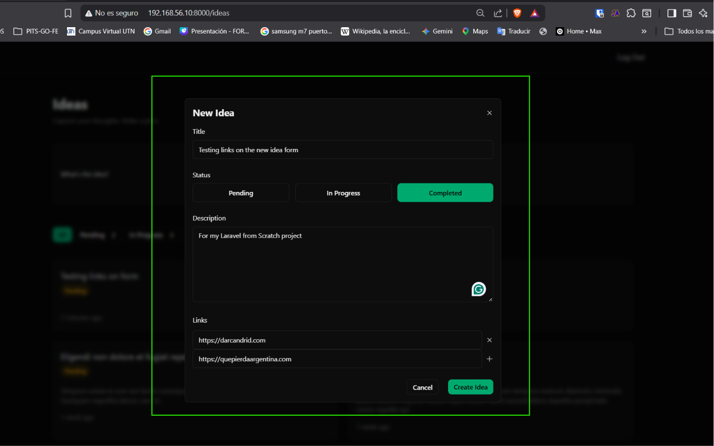
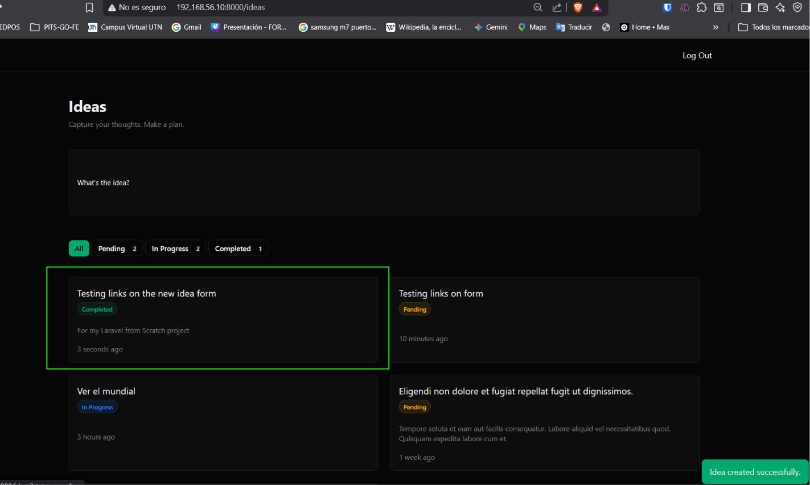

[< Volver al índice](../entregable03.md)

# Episodio 34 - Allow For One or Many Links

En este episodio agregué la posibilidad de asociar uno o varios enlaces a una idea desde el formulario de creación.

## Campo de Links en el formulario (`index.blade.php`)

Agregué un bloque debajo del campo de descripción, con un `<template x-for>` que recorre un arreglo `links` y un input reutilizable para ir agregando nuevos como Jefrey lo iba haciendo:

```blade
<div>
    <fieldset class="space-y-3">
        <legend class="label">Links</legend>

        <template x-for="(link, index) in links">
            <div class="flex gap-x-2 items-center">
                <input name="links[]" x-model="link" class="input">

                <button
                    type="button"
                    aria-label="Remove link"
                    @click="links.splice(index, 1)"
                    class="form-muted-icon"
                >
                    <x-icons.close />
                </button>
            </div>
        </template>
    </fieldset>

    <div class="flex gap-x-2 items-center">
        <input
            x-model="newLink"
            type="url"
            id="new-link"
            data-test="new-link"
            placeholder="http://example.com"
            autocomplete="url"
            class="input flex-1"
            spellcheck="false"
        >

        <button
            type="button"
            @click="links.push(newLink.trim()); newLink = '';"
            data-test="submit-new-link-button"
            :disabled="newLink.trim().length === 0"
            aria-label="Add a new link"
            class="form-muted-icon"
        >
            <x-icons.close class="rotate-45" />
        </button>
    </div>
</div>
```

Cada link agregado aparece en la lista con su propio botón para eliminarlo, y el botón "+" para agregar uno nuevo se deshabilita mientras el input esté vacío.

## Ampliación del `x-data` del formulario

El `<form>` ya manejaba `status` con Alpine, así que solo tuve que ampliar su estado inicial para incluir el arreglo de `links` y el input temporal `newLink`:

```blade
<form x-data="{status:'pending', links: [], newLink: ''}" method="POST" action="{{ route('idea.store') }}">
```

## Validación de links (`StoreIdeaRequest`)

```php
'links' => ['nullable', 'array'],
'links.*' => ['nullable', 'max:255'],
```

## Evidencia





## Problema encontrado
**Botón "+" como x**: el ícono de agregar link usaba el mismo componente <x-icons.close> que el de cerrar, pasndole class="rotate-45" para que se viera como un signo "+". Sin embargo, el SVG del componente tenía la clase `size-4` escrita directamente en la etiqueta, sin usar `{{ $attributes }}`, por lo que cualquier clase pasada desde afuera se perdía. Lo corregí usando `$attributes->merge()`:

```blade
<svg xmlns="http://www.w3.org/2000/svg" fill="none" viewBox="0 0 24 24" stroke-width="1.5" stroke="currentColor" {{ $attributes->merge(['class' => 'size-4']) }}>
```

<sub>Documentado por Xavier Fernández Zúñiga - ISW-811</sub>