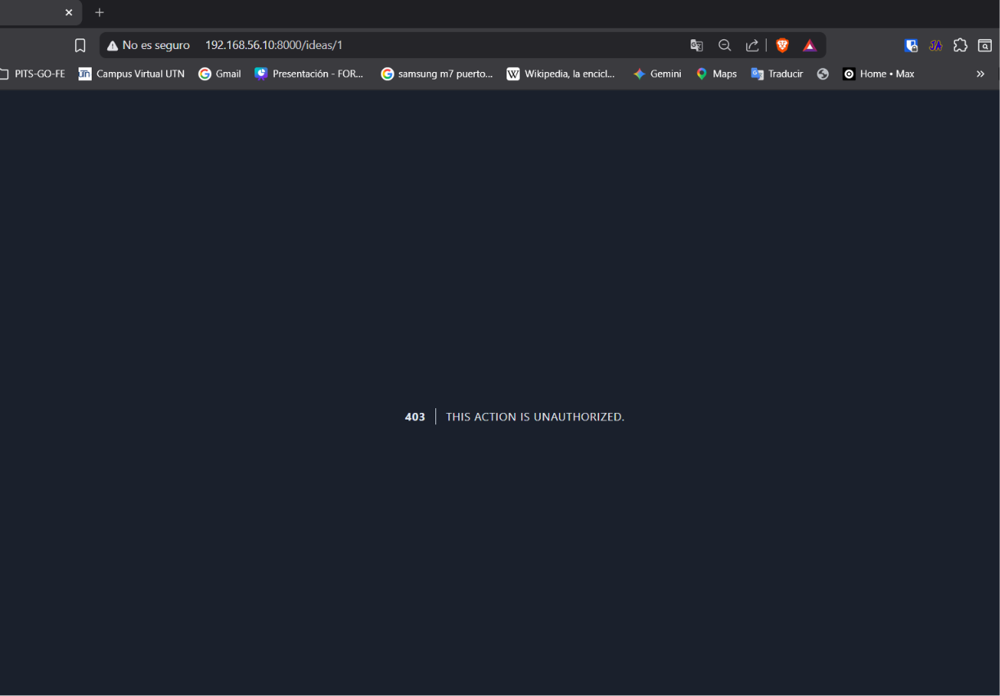
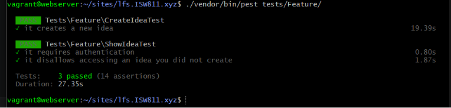

[< Volver al índice](../entregable03.md)

# Episodio 38 - Authorization Is A Requirement

En este episodio agregué autorización a las acciones sobre una idea, para que un usuario solo pueda ver, editar o eliminar las ideas que él mismo creó. Usé una Policy de Laravel junto con `Gate::authorize()` directamente en el controlador, Jefrey explico que se puede hacer desde el web.php pero preferí seguirle la corriente.

## Policy `IdeaPolicy`

Ya existía el archivo `app/Policies/IdeaPolicy.php` asi que le agregué el método `workWith`, que compara al usuario autenticado con el dueño de la idea:

```php
class IdeaPolicy
{
    public function workWith(User $user, Idea $idea): bool
    {
        return $idea->user->is($user);
    }
}
```

## Dos formas posibles de aplicar la autorización

Antes de decidir, exploré dos alternativas que ofrece Laravel para aplicar esta policy:

**Opción 1 — directamente en la ruta**, usando el modificador `->can()`:
```php
Route::get('/ideas/{idea}', [IdeaController::class, 'show'])->name('idea.show')->middleware('auth')->can('workWith', 'idea');
```

**Opción 2 — dentro del controlador**, usando el facade `Gate`:
```php
public function show(Idea $idea)
{
    Gate::authorize('workWith', $idea);

    return view('ideas.show', ['idea' => $idea]);
}
```

Terminé optando por la **Opción 2** (Gate en el controlador), porque me resultó más explícita, además de que me resulta más facil de entender si sigo la misma linea de Jefrey.

## Aplicación en `IdeaController`

```php
public function show(Idea $idea)
{
    Gate::authorize('workWith', $idea);

    return view('ideas.show', ['idea' => $idea]);
}

public function edit(Idea $idea)
{
    Gate::authorize('workWith', $idea);
}

public function update(UpdateIdeaRequest $request, Idea $idea)
{
    Gate::authorize('workWith', $idea);
}

public function destroy(Idea $idea)
{
    Gate::authorize('workWith', $idea);

    $idea->delete();

    return to_route('idea.index');
}
```

## Tests de autorización (`ShowIdeaTest`)

```php
it('requires authentication', function () {
    $idea = Idea::factory()->create();

    $this->get(route('idea.show', $idea))->assertRedirectToRoute('login');
});

it('disallows accessing an idea you did not create', function () {
    $user = User::factory()->create();

    $this->actingAs($user);

    $idea = Idea::factory()->create();

    $this->get(route('idea.show', $idea))->assertForbidden();
});
```

También actualicé `CreateIdeaTest.php` para reflejar el formulario completo (con links y steps), ya que es la evolución natural del mismo test a través de los episodios, no un test nuevo:

```php
it('creates a new idea', function () {
    $user = User::factory()->create();

    $this->actingAs($user)
        ->post('/ideas', [
            'title' => 'Some Example Title',
            'status' => 'completed',
            'description' => 'An example description',
            'links' => ['https://laracasts.com', 'https://laravel.com'],
            'steps' => ['An example step', 'Another example step'],
        ])
        ->assertRedirect('/ideas');

    $idea = $user->ideas()->first();

    expect($idea)->toMatchArray([
        'title' => 'Some Example Title',
        'status' => 'completed',
        'description' => 'An example description',
        'links' => ['https://laracasts.com', 'https://laravel.com'],
    ]);

    expect($idea->steps)->toHaveCount(2);
});
```

## Evidencia





<sub>Documentado por Xavier Fernández Zúñiga - ISW-811</sub>