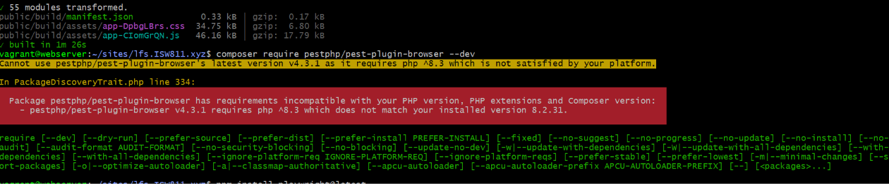
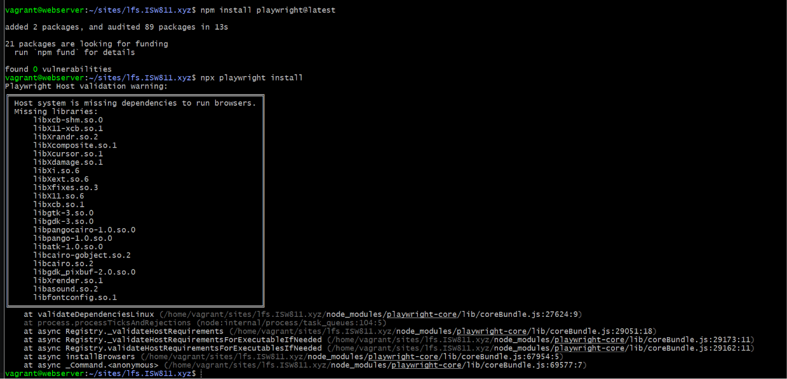

[< Volver al índice](../entregable02.md)

# Episodio 26: Browser Testing Registration Forms With Pest

En este episodio Jewfrey configuró browser testing con Pest usando el plugin `pestphp/pest-plugin-browser` y Playwright, y escribió tests para los flujos de registro, login y logout.

## Instalación del plugin de browser testing

```bash
composer require pestphp/pest-plugin-browser --dev
npm install playwright@latest
npx playwright install
```

En mi caso, `composer require pestphp/pest-plugin-browser --dev` falló porque la única versión disponible requiere PHP `^8.3` y mi VM corre PHP 8.2.31. Los comandos de npm y Playwright sí se ejecutaron correctamente, descargando Chromium, Firefox y WebKit.

## Reestructuración de carpetas de tests

La carpeta `tests/Feature` se renombró a `tests/Browser` para agrupar ahí los tests de browser:

```bash
mv tests/Feature tests/Browser
```

Y se actualizó `tests/Pest.php` para aplicar `RefreshDatabase` a `Browser` y `Unit`:

```php
pest()->extend(Tests\TestCase::class)
    ->use(Illuminate\Foundation\Testing\RefreshDatabase::class)
    ->in('Browser', 'Unit');
```

## Tests de autenticación

`tests/Browser/RegisterTest.php`:

```php
use Illuminate\Support\Facades\Auth;

it('registers a user', function () {
    visit('/register')
        ->fill('name', 'John Doe')
        ->fill('email', 'john@example.com')
        ->fill('password', 'password123!@#')
        ->click('Create Account')
        ->assertPathIs('/');

    $this->assertAuthenticated();

    expect(Auth::user())->toMatchArray([
        'name' => 'John Doe',
        'email' => 'john@example.com',
    ]);
});
```

`tests/Browser/LoginTest.php`:

```php
use App\Models\User;

it('logs in a user', function () {
    $user = User::factory()->create(['password' => 'password123!@#']);

    visit('/login')
        ->fill('email', $user->email)
        ->fill('password', 'password123!@#')
        ->click('@login-button')
        ->assertPathIs('/');

    $this->assertAuthenticated();
});

it('logs out a user', function () {
    $user = User::factory()->create();

    $this->actingAs($user);

    visit('/')->click('Log Out');

    $this->assertGuest();
});
```

El botón de login requiere el atributo `dusk` para ser identificado por el test:

```blade
<button type="submit" class="btn mt-2 h-10 w-full" dusk="login-button">Sign in</button>
```

## Evidencia





## Problema encontrado

El plugin `pestphp/pest-plugin-browser` requiere PHP `^8.3` en su única versión disponible, mientras mi VM corre PHP 8.2.31. Esto impidió instalar el plugin y por tanto ejecutar los tests de browser. Los archivos de test fueron creados siguiendo el código del profesor pero no son ejecutables en este ambiente. Esta es la misma limitación encontrada en el episodio 22.

<sub>Documentado por Xavier Fernández Zúñiga - ISW-811</sub>