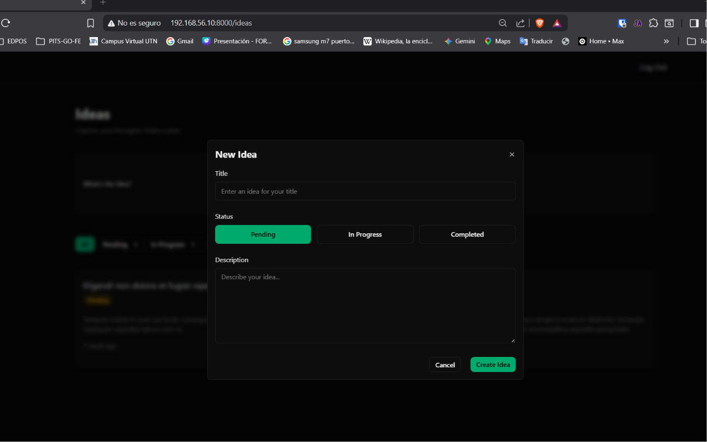
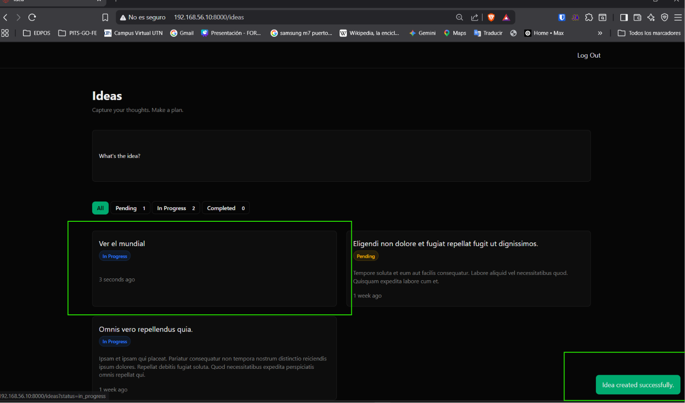

[< Volver al índice](../entregable03.md)

# Episodio 32 - Construct The Idea Form

En este episodio construí el formulario pra crear una idea, integrado dentro del modal que ya tenía funcionando desde el episodio anterior. El formulario incluye título, selector de estado con botones y descripción, junto con la lógica de backend para validar y persistir la idea.

## Formulario dentro del modal (`index.blade.php`)


```blade
<form x-data="{status:'pending'}" method="POST" action="{{ route('idea.store') }}">
    @csrf

    <div class="space-y-6">
        <x-form.field
            label="Title"
            name="title"
            placeholder="Enter an idea for your title"
            autofocus
            required
        />

        <div class="space-y-2">
            <label for="status" class="label">Status</label>

            <div class="flex gap-x-3">
                @foreach (App\IdeaStatus::cases() as $status)
                    <button
                        type="button"
                        @click="status = @js($status->value)"
                        class="btn flex-1 h-10"
                        :class="{'btn-outlined': status !== @js($status->value)}"
                    >
                        {{ $status->label() }}
                    </button>
                @endforeach

                <input type="hidden" name="status" :value="status" class="input">
            </div>

            <x-form.error name="status" />
        </div>

        <x-form.field
            label="Description"
            name="description"
            type="textarea"
            placeholder="Describe your idea..."
        />

        <div class="flex justify-end gap-x-5">
            <button type="button" @click="$dispatch('close-modal')" class="btn btn-outlined">Cancel</button>
            <button type="submit" class="btn btn-primary">Create Idea</button>
        </div>
    </div>
</form>
```


## Componentes reutilizables `form.field` y `form.error`

Separé la lógica de mostrar errores de validación en su propio componente, para no repetirla en cada campo tl como lo hizo el profesor Jefrey:+

```blade
{{-- error.blade.php --}}
@props(['name'])

@error($name)
    <p class="error">{{ $message }}</p>
@enderror
```

Y `field.blade.php` ahora reutiliza ese componente en vez de tener el `@error` inline:

```blade
@props(['label' => false, 'name', 'type' => 'text'])

<div class="space-y-2">
    @if ($label)
        <label for="{{ $name }}" class="label">{{ $label }}</label>
    @endif

    @if ($type === 'textarea')
        <textarea
            name="{{ $name }}"
            id="{{ $name }}"
            class="textarea"
            {{ $attributes }}
        >{{ old($name) }}</textarea>
    @else
        <input
            type="{{ $type }}"
            id="{{ $name }}"
            name="{{ $name }}"
            class="input"
            value="{{ old($name) }}"
            {{ $attributes }}
        >
    @endif

    <x-form.error name="{{ $name }}" />
</div>
```

## Ruta y controlador

Nombré la ruta de creación para poder referenciarla con el helper `route()`:

```php
Route::post('/ideas', [IdeaController::class, 'store'])->name('idea.store')->middleware('auth');
```

Y completé el método `store()` del controlador, asociando la idea al usuario autenticado y validando los datos con un Form Request:

```php
public function store(StoreIdeaRequest $request)
{
    Auth::user()->ideas()->create($request->validated());

    return to_route('idea.index')->with('success', 'Idea created successfully.');
}
```

## Validación (`StoreIdeaRequest`)

```php
public function rules(): array
{
    return [
        'title' => ['required', 'string', 'max:255'],
        'description' => ['nullable', 'string'],
        'status' => ['required', Rule::enum(IdeaStatus::class)],
    ];
}
```

## Método `values()` en el enum `IdeaStatus`

El controlador necesitaba filtrar ideas por status usando `in_array()`, pero los enums nativos de PHP no traen un método `values()` incorporado. Lo agregué siguiendo el mismo estilo que `label()`:

```php
public static function values(): array
{
    return array_column(self::cases(), 'value');
}
```

## Evidencia






<sub>Documentado por Xavier Fernández Zúñiga - ISW-811</sub>