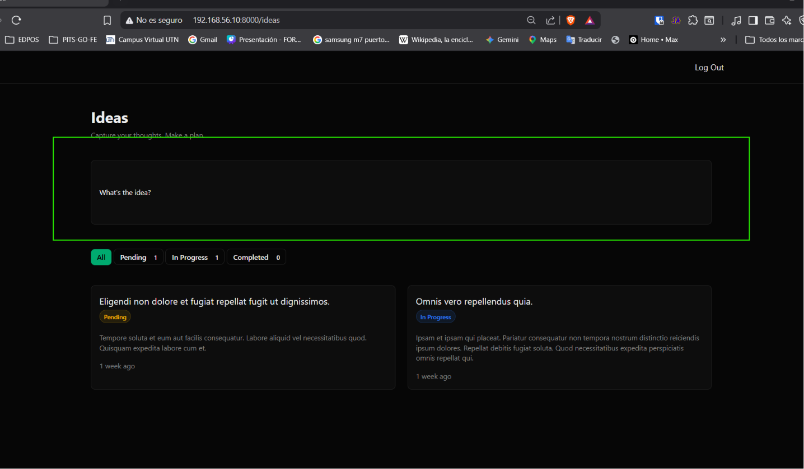
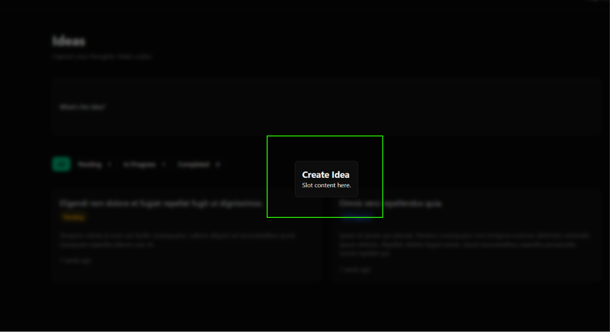

[< Volver al índice](../entregable03.md)

# Episodio 31 - Create A Functional Modal With AlpineJS

En este episodio implementé un modal funcional usando AlpineJS, reutilizando el componente `x-card` que ya tenía creado para las tarjetas de ideas. La idea es que al hacer clic en el cuadro "What's the idea?" de la vista `index.blade.php`, se abra un modal para crear una nueva idea tal como Jefrey explico.

## Modificación de `index.blade.php`

Convertí el cuadro superior en un botón interactivo usando la prop `is` del componente `x-card`, y le agregué `x-data` y un `@click` que dispara un evento global con Alpine:

```blade
<x-card 
    x-data
    @click="$dispatch('open-modal', 'create-idea')"
    is="button"
    class="mt-10 cursor-pointer h-32 w-full text-left"
>
    <p>What's the idea?</p>
</x-card>
```

Y agregué la instancia del modal al final del layout de la página:

```blade
<x-modal name="create-idea" title="Create Idea">
    <p> Slot content here. </p>
</x-modal>
```

## Modificación de `card.blade.php`

Le agregué soporte a una prop `is`, para que el componente pueda renderizarse como cualquier elemento HTML (`a`, `button`, `div`, etc.) según el contexto donde se use, en lugar de estar atado solo a un enlace:

```blade
@props(['is' => 'a'])

<{{ $is }} {{ $attributes(['class' => 'border border-border rounded-lg bg-card p-4 md:text-sm block']) }}>
    {{ $slot }}
</{{ $is }}>
```

## Nuevo componente `modal.blade.php`

Creé el componente reutilizable del modal, que escucha el evento `open-modal` disparado desde cualquier parte de la aplicación, y solo se muestra si el nombre del evento coincide con el `name` que recibe como prop:

```blade
@props(['name', 'title'])

<div 
    x-data="{ show: false, name: @js($name) }"
    x-show="show"
    @open-modal.window="if ($event.detail === name) show = true;"
    @keydown.escape.window="show = false"
    x-transition:enter="ease-out duration-200"
    x-transition:enter-start="opacity-0 -translate-y-4 -translate-x-4"
    x-transition:enter-end="opacity-100"
    x-transition:leave="ease-in duration-150"
    x-transition:leave-start="opacity-100"
    x-transition:leave-end="opacity-0 -translate-y-4 -translate-x-4"
    class="fixed inset-0 z-50 flex items-center justify-center bg-black/50 backdrop-blur-xs"
    style="display: none;"
    role="dialog"
    aria-modal="true"
    aria-labelledby="modal-{{ $name }}-title"
    :aria-hidden="!show"
    tabindex="-1"
>
    <x-card @click.away="show = false">
        <div>
            <h2 id="modal-{{ $name }}-title" class="text-xl font-bold">{{ $title }}</h2>
        </div>

        <div>
            {{ $slot }}
        </div>
    </x-card>
</div>
```

## Evidencia





## Problema encontrado

Al implementar el modal, el clic en el botón "What's the idea?" no producía ningún efecto visible y la consola del navegador no mostraba ningún error.


La causa estaba en un desajuste entre cómo se disparaba el evento y cómo se escuchaba:

```blade
@click="$dispatch('open-modal', { name: 'create-idea' })"
```

Esto enviaba un objeto como `event.detail`, pero el modal comparaba ese `detail` directamente contra un string:

```blade
@open-modal.window="if ($event.detail === name) show = true;"
```


```blade
@click="$dispatch('open-modal', 'create-idea')"
```

<sub>Documentado por Xavier Fernández Zúñiga - ISW-811</sub>