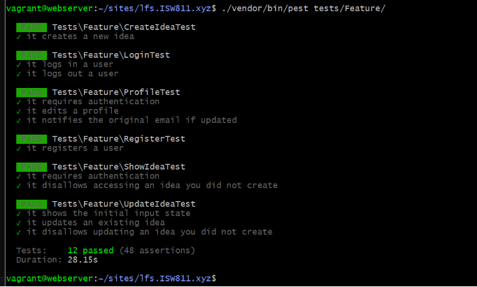
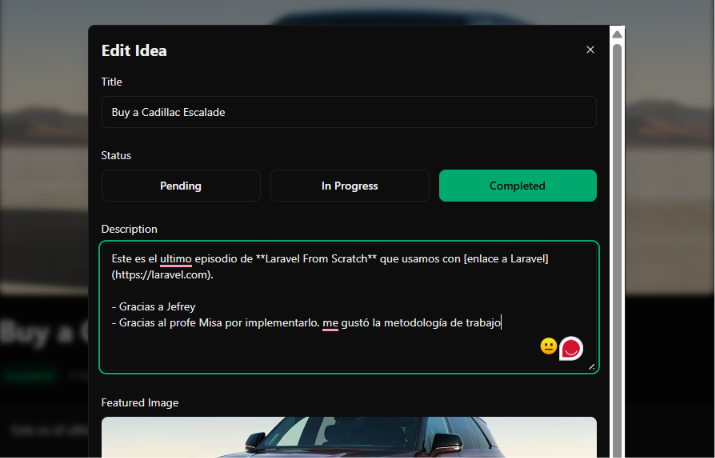

[< Volver al índice](../entregable03.md)

# Episodio 42 - Deploy And Then Implement A Feature Request

Este episodio Jefrey hizo un cierre de calidad antes de un despliegue a producción (corriendo el formateador de código y la suite de tests, arreglando lo que fallaba, y desplegando a Laravel Forge); y la implementación de una nueva funionalidad ya en producción para demostrar el flujo completo de desarrollo, prueba y despliegue.


## Parte 1: Corrección de tests antes del despliegue

Al correr la suite completa de tests, aparecieron 2 fallos relacionados con los tests de login y registro: ambos esperaban que, tras autenticarse, la aplicación redirigiera a la página de inicio (`/`), pero en episodios anteriores ya habíamos cambiado ese comportamiento para redirigir a `/ideas` (`idea.index`). Corregí los tres controladores involucrados:

**`SessionsController` (login y logout):**
```php
public function store(Request $request)
{
    // ...
    return redirect()->intended(route('idea.index'))->with('success', 'You are now logged in.');
}

public function destroy()
{
    Auth::logout();

    return redirect()->route('idea.index');
}
```

**`RegisteredUserController` (registro):**
```php
public function store(Request $request)
{
    // ...
    return redirect()->route('idea.index')->with('success', 'Your account has been created.');
}
```

Adapté también los tests correspondientes a `tests/Feature/LoginTest.php` y `tests/Feature/RegisterTest.php`, ya que los originales en `tests/Browser/` no pueden ejecutarse en mi entorno (PHP 8.2.31):

```php
it('logs in a user', function () {
    $user = User::factory()->create(['password' => 'password123!@#']);

    $this->post('/login', [
        'email' => $user->email,
        'password' => 'password123!@#',
    ])->assertRedirect(route('idea.index'));

    $this->assertAuthenticated();
});
```

Con estas correcciones, la suite completa de `tests/Feature/` pasó con 12 tests y 48 assertions.

## Parte 2: Deploy a Laravel Forge (documentación, sin ejecutar)

Según el procedimiento mostrado en el curso, el flujo de despliegue continuo sería:

1. Conectar el repositorio de GitHub a un sitio en Laravel Forge
2. Configurar el servidor (PHP, base de datos, variables de entorno)
3. Activar el *Quick Deploy*, que redespliega automáticamente ante cada `git push` a la rama principal, mediante un webhook de GitHub
4. Al primer despliegue, el curso muestra un fallo real: una migración usaba un valor por defecto de columna incompatible con MySQL (motor usado en producción), mientras que localmente se usaba SQLite. La solución fue configurar SQLite también en el entorno de producción, evitando la incompatibilidad de sintaxis SQL entre motores.
5. Tras el fix, el despliegue se completa correctamente y la aplicación queda accesible en producción.

En mi caso, todo el desarrollo y las pruebas se mantienen en el entorno local que hicimos con el profe Misa (VM Vagrant/VirtualBox), sin necesidad de un servidor de producción real, cumpliendo con la evidencia de ejecución local que pide el entregable.

## Parte 3: Feature Request — formato Markdown en la descripción

Como ejercicio de flujo completo de desarrollo (crear una funcionalidad, probarla, y "desplegarla"), agregué soporte para que la descripción de una idea admita formato Markdown.

### Accessor `formattedDescription` en el modelo `Idea`

```php
use Illuminate\Support\Str;
use Illuminate\Database\Eloquent\Casts\Attribute;

public function formattedDescription(): Attribute
{
    return Attribute::make(
        get: fn () => Str::markdown($this->description ?? ''),
    );
}
```

`Str::markdown()` es un helper de Laravel que convierte texto en formato Markdown a HTML.

### Mostrar el HTML formateado en `show.blade.php`

```blade
@if ($idea->description)
    <x-card class="mt-6" is="div">
        <div class="text-foreground max-w-none cursor-pointer prose prose-invert">
            {!! $idea->formatted_description !!}
        </div>
    </x-card>
@endif
```


### Plugin de tipografía de Tailwind

```bash
npm install @tailwindcss/typography
```

```css
@plugin "@tailwindcss/typography";
```

Las clases `prose prose-invert` aplican un formato tipográfico legible al contenido HTML generado (títulos, listas, negritas, links), y `prose-invert` adapta esos estilos para verse correctamente sobre el fondo oscuro del proyecto.

## Evidencia







## Comentarios personales

Este episodio combinó dos lecciones distintas, por un lado, la importancia de correr la suite de tests completa antes de cualquier despliegue, ya que detectó un desajuste real que había quedado sin resolver de episodios anteriores. Por otro lado, trabajar con accessors de Eloquent me dejó más claro que el nombre del método (camelCase) y el nombre de acceso como propiedad (snake_case) no son intercambiables, una convención que no había interiorizado del todo hasta este error silencioso donde simplemente no se mostraba nada, sin ningún mensaje de error que lo señalara directamente. Al ser el ultimo episodio me siento satisfecho del aprendizaje obtenido y me gustó la metodología que decidió implementar el profe Misa para este proyecto. Considero que Laravel From Scratch fue una buena herramienta para fortalecer conocimientos y la forma de trabajarlo fue muy provechosa.

<sub>Documentado por Xavier Fernández Zúñiga - ISW-811</sub>