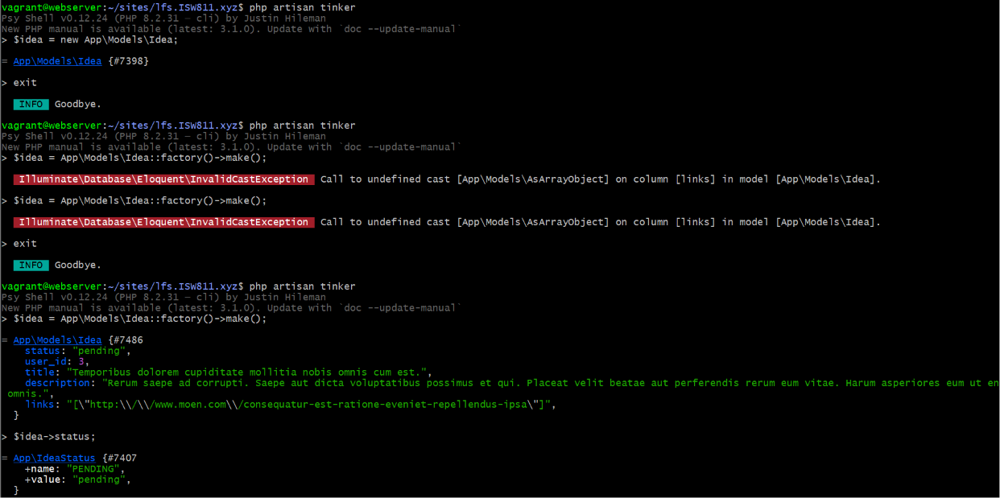
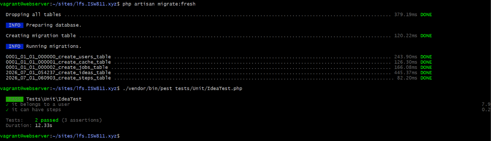

[< Volver al índice](../entregable02.md)

# Episodio 24: Design Your Model Layer

En este episodio diseñé la capa de modelos del proyecto final. Creé los modelos, migraciones, factories, controladores y políticas necesarios, además de un enum para representar los estados de una idea y tests unitarios para verificar las relaciones entre modelos.

## Creación del modelo Idea y sus recursos

Usé `make:model` con todas las opciones de una sola vez para generar todos los archivos relacionados:

```bash
php artisan make:model Idea -a
```

Esto generó automáticamente:
- `app/Models/Idea.php`
- `database/factories/IdeaFactory.php`
- `database/migrations/2026_07_01_054237_create_ideas_table.php`
- `app/Http/Requests/StoreIdeaRequest.php`
- `app/Http/Requests/UpdateIdeaRequest.php`
- `app/Http/Controllers/IdeaController.php`
- `app/Policies/IdeaPolicy.php`

## Migración de ideas

Definí la estructura de la tabla `ideas` con soporte para estado, imagen, links en formato JSON y clave foránea hacia el usuario:

```php
Schema::create('ideas', function (Blueprint $table) {
    $table->id();
    $table->foreignIdFor(User::class)->constrained()->cascadeOnDelete();
    $table->string('title');
    $table->text('description')->nullable();
    $table->string('status')->default('pending');
    $table->string('image_path')->nullable();
    $table->json('links')->default('[]');
    $table->timestamps();
});
```

## Enum IdeaStatus

Creé un enum respaldado por string para representar los tres estados posibles de una idea:

```bash
php artisan make:enum IdeaStatus
```

```php
enum IdeaStatus: string
{
    case PENDING = 'pending';
    case IN_PROGRESS = 'in_progress';
    case COMPLETED = 'completed';

    public function label(): string
    {
        return match ($this) {
            self::PENDING => 'Pending',
            self::IN_PROGRESS => 'In Progress',
            self::COMPLETED => 'Completed',
        };
    }
}
```

## Modelo Idea

Configuré el modelo con casts para el enum y los links, valor por defecto para el estado, y relaciones:

```php
class Idea extends Model
{
    use HasFactory;

    protected $casts = [
        'links' => AsArrayObject::class,
        'status' => IdeaStatus::class,
    ];

    protected $attributes = [
        'status' => 'pending',
    ];

    public function user(): BelongsTo
    {
        return $this->belongsTo(User::class);
    }

    public function steps(): HasMany
    {
        return $this->hasMany(Step::class);
    }
}
```

## Modelo Step y su migración

Creé el modelo `Step` con factory y migración:

```bash
php artisan make:model Step -mf
```

La migración de `steps` incluye la clave foránea hacia `ideas` y el campo `completed` con valor por defecto `false`:

```php
Schema::create('steps', function (Blueprint $table) {
    $table->id();
    $table->foreignIdFor(Idea::class)->constrained()->cascadeOnDelete();
    $table->string('description');
    $table->boolean('completed')->default(false);
    $table->timestamps();
});
```

## AppServiceProvider

Configuré el `AppServiceProvider` para desactivar la protección de mass assignment, activar el modo estricto y habilitar el eager loading automático de relaciones:

```php
public function boot(): void
{
    Model::unguard();
    Model::shouldBeStrict();
    Model::automaticallyEagerLoadRelationships();
}
```

## IdeaFactory

Definí los datos de prueba para el factory de ideas:

```php
public function definition(): array
{
    return [
        'user_id' => User::factory(),
        'title' => fake()->sentence(),
        'description' => fake()->paragraph(),
        'links' => [fake()->url()],
    ];
}
```

## Tests unitarios

Creé `tests/Unit/IdeaTest.php` con dos tests que verifican las relaciones del modelo:

```php
test('it belongs to a user', function () {
    $idea = Idea::factory()->create();
    expect($idea->user)->toBeInstanceOf(User::class);
});

test('it can have steps', function () {
    $idea = Idea::factory()->create();
    expect($idea->steps)->toBeEmpty();

    $idea->steps()->create([
        'description' => 'Do the thing',
    ]);

    expect($idea->fresh()->steps)->toHaveCount(1);
});
```

También actualicé `tests/Pest.php` para que `RefreshDatabase` aplique tanto a tests de `Feature` como de `Unit`:

```php
pest()->extend(Tests\TestCase::class)
    ->use(Illuminate\Foundation\Testing\RefreshDatabase::class)
    ->in('Feature', 'Unit');
```

## Evidencia






<sub>Documentado por Xavier Fernández Zúñiga - ISW-811</sub>