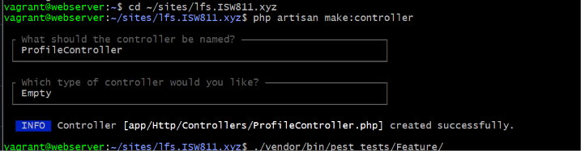
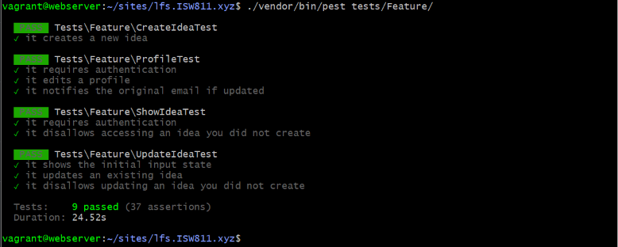
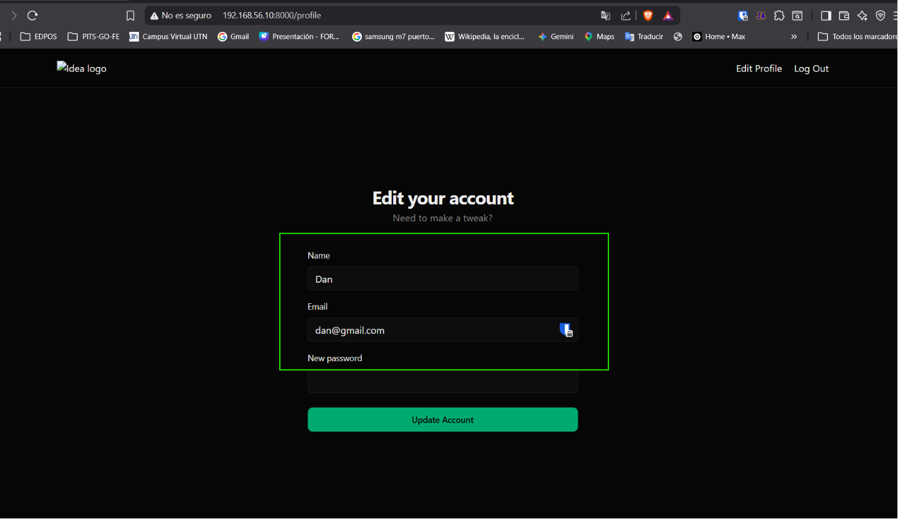
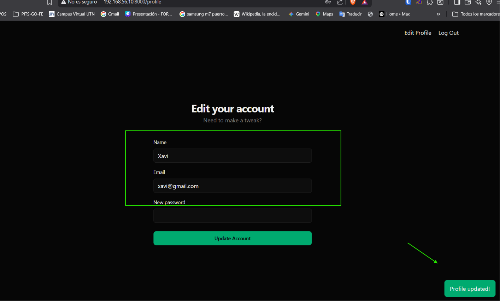

[< Volver al índice](../entregable03.md)

# Episodio 41 - Edit Your Profile

En este episodio implementé la funcionalidad de edición de perfil de usuario: nombre, email y contraseña, junto con una notificación de seguridad que se envía al correo original cuando el usuario cambia su dirección de email.

## Enlace en la barra de navegación

```blade
@auth
    <a href="{{ route('profile.edit') }}">Edit Profile</a>

    <form method="POST" action="/logout">
        @csrf
        <button>Log Out</button>
    </form>
@endauth
```

## Rutas de perfil

```php
Route::get('profile', [ProfileController::class, 'edit'])->name('profile.edit')->middleware('auth');
Route::patch('profile', [ProfileController::class, 'update'])->name('profile.update')->middleware('auth');
Route::delete('profile', [ProfileController::class, 'destroy'])->name('profile.destroy')->middleware('auth');
```

## Controlador de perfil

```php
class ProfileController extends Controller
{
    public function edit()
    {
        return view('profile.edit', [
            'user' => auth()->user()
        ]);
    }

    public function update(Request $request)
    {
        $user = Auth::user();

        $request->validate([
            'name' => ['required', 'string', 'max:255'],
            'email' => [
                'required', 'string', 'email', 'max:255',
                Rule::unique('users', 'email')->ignore($user->id),
            ],
            'password' => ['nullable', Password::defaults()],
        ]);

        $originalEmail = $user->email;

        $user->update([
            'name' => $request->name,
            'email' => $request->email,
            'password' => $request->password ?? $user->password,
        ]);

        if ($originalEmail !== $request->email) {
            Notification::route('mail', $originalEmail)
                ->notify(new EmailChanged($user, $originalEmail));
        }

        return redirect()->route('profile.edit')->with('success', 'Profile updated!');
    }
}
```

## Vista del formulario (`profile/edit.blade.php`)

```blade
<x-layout>
    <x-form title="Edit your account" description="Need to make a tweak?">
        <form action="/profile" method="POST" class="mt-10 space-y-4">
            @csrf
            @method('PATCH')

            <x-form.field name="name" label="Name" :value="$user->name" />
            <x-form.field name="email" label="Email" type="email" :value="$user->email" />
            <x-form.field name="password" label="New password" type="password" />

            <button type="submit" class="btn mt-2 h-10 w-full">Update Account</button>
        </form>
    </x-form>
</x-layout>
```

## Notificación de cambio de email (`EmailChanged`)

Cuando el usuario cambia su dirección de correo, se envía una notificación al correo original como medida de seguridad para alertar sobre el cambio incluso si la cuenta esta comprometida.

```php
class EmailChanged extends Notification
{
    use Queueable;

    public function __construct(protected User $user, protected string $originalEmail)
    {
    }

    public function via(object $notifiable): array
    {
        return ['mail'];
    }

    public function toMail(object $notifiable): MailMessage
    {
        return (new MailMessage)
            ->subject('Your email address has changed')
            ->line("Your account's email address was changed to {$this->user->email}.")
            ->line('If you did not make this change, please contact support immediately.');
    }
}
```

Se envía usando notificación "on demand", dirigida explícitamente al correo anterior en vez del usuario actual:
```php
Notification::route('mail', $originalEmail)
    ->notify(new EmailChanged($user, $originalEmail));
```

## Tests (`tests/Feature/ProfileTest.php`)

```php
it('requires authentication', function () {
    $this->get(route('profile.edit'))->assertRedirect('/login');
});

it('edits a profile', function () {
    $user = User::factory()->create();

    $this->actingAs($user)
        ->patch('/profile', [
            'name' => 'New Name',
            'email' => 'new@example.com',
        ])
        ->assertRedirect(route('profile.edit'));

    expect($user->fresh())->toMatchArray([
        'name' => 'New Name',
        'email' => 'new@example.com',
    ]);
});

it('notifies the original email if updated', function () {
    Notification::fake();

    $user = User::factory()->create();
    $originalEmail = $user->email;

    $this->actingAs($user)
        ->patch('/profile', [
            'name' => $user->name,
            'email' => 'new@example.com',
        ]);

    Notification::assertSentOnDemand(EmailChanged::class, function (EmailChanged $notification, $channels, $notifiable) use ($originalEmail) {
        return $notifiable->routes['mail'] === $originalEmail;
    });
});
```

## Evidencia









<sub>Documentado por Xavier Fernández Zúñiga - ISW-811</sub>