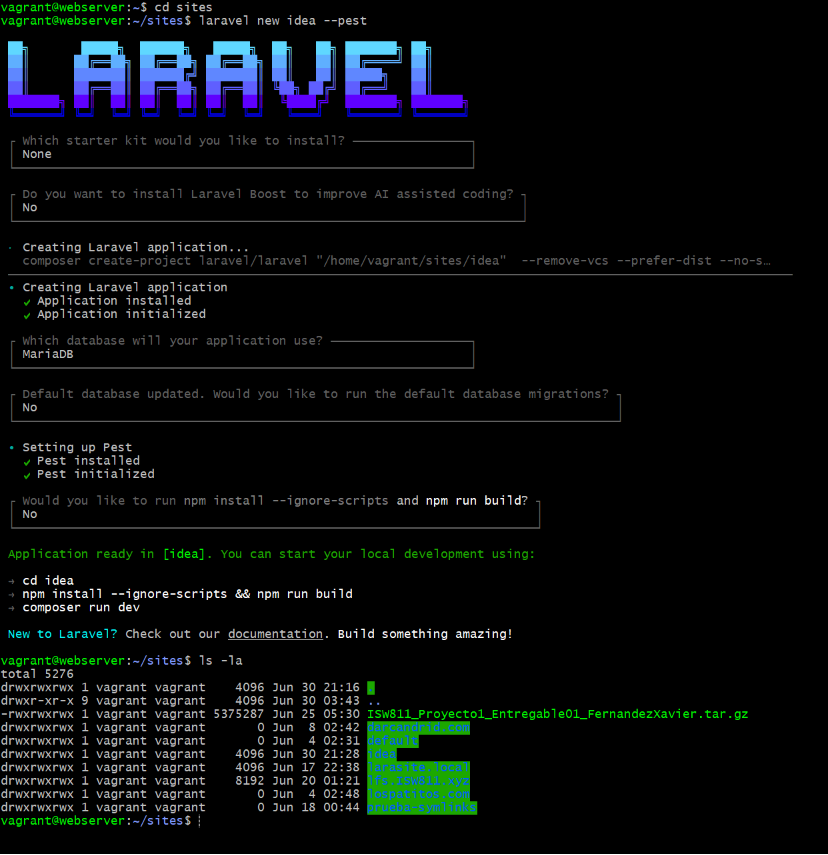
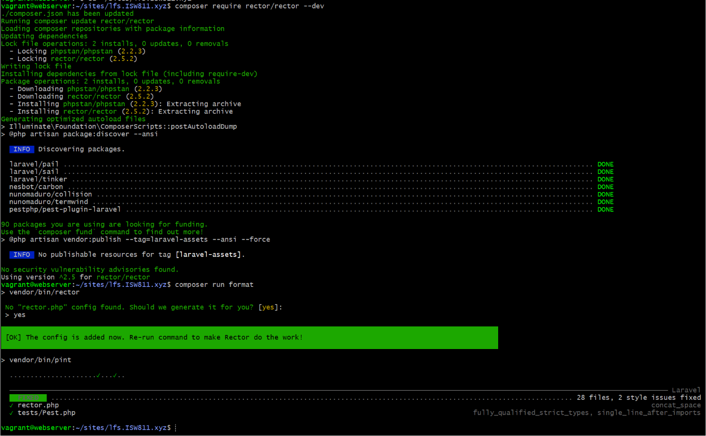

[< Volver al índice](../entregable02.md)

# Episodio 23: Final Project Setup

En este episodio inicié el proyecto final del curso. En lugar de crear un repositorio nuevo, la estrategia fue crear un proyecto Laravel fresco, trasladarle el historial de git y la carpeta de documentación del proyecto anterior, y renombrarlo para que ocupe el mismo lugar. De esta forma, el repositorio mantiene todo el historial previo de commits pero el código es completamente nuevo. Omití la parte explicada por Jefrey y me guié con el video del profe Misa en la sesión con el compañero Brian para crear el proyecto.

## Respaldo del proyecto anterior

Antes de hacer cualquier cambio, creé un respaldo comprimido del proyecto anterior excluyendo las carpetas pesadas que se pueden regenerar:

```bash
tar cvfz lfs.ISW811.xyz.respaldo.tar.gz \
  --exclude={lfs.ISW811.xyz/node_modules,lfs.ISW811.xyz/vendor} \
  lfs.ISW811.xyz/
```

## Creación del nuevo proyecto

Dentro de `~/sites`, creé un proyecto Laravel nuevo con Pest como framework de testing:

```bash
laravel new idea --pest
```

## Migración del historial y documentación

Copié la carpeta `.git` del proyecto anterior al nuevo para conservar el historial de commits, y moví la carpeta `docs` con toda la documentación acumulada:

```bash
cp -r ../lfs.ISW811.xyz/.git .
mv ../lfs.ISW811.xyz/docs .
```

## Renombrado de carpetas

Desde Windows (Git Bash), renombré el proyecto viejo y el nuevo:

```bash
mv lfs.ISW811.xyz lfs.ISW811.xyz.old
mv idea lfs.ISW811.xyz
```

## Configuración del .env

Actualicé el `.env` del nuevo proyecto con las credenciales de la base de datos existente:

```env
DB_DATABASE=lfs_isw811_xyz
DB_USERNAME=lfsuser
DB_PASSWORD=secret
```

Y corrí las migraciones iniciales:

```bash
php artisan migrate
```

## Scripts en composer.json

Agregué scripts de utilidad al `composer.json` para automatizar tareas comunes:

```json
"scripts": {
    "setup": [
        "composer install",
        "@php -r \"file_exists('.env') || copy('.env.example', '.env');\"",
        "@php artisan key:generate",
        "@php artisan migrate --force",
        "npm install",
        "npm run build"
    ],
    "format": [
        "vendor/bin/rector",
        "vendor/bin/pint"
    ]
}
```

## Instalación de Rector y Pint

Instalé Rector como dependencia de desarrollo para refactorización automática del código:

```bash
composer require rector/rector --dev
```

Y ejecuté el script de formato, que corre Rector y Pint en secuencia:

```bash
composer run format
```

Rector analizó y modernizó los archivos del proyecto aplicando reglas como `DeclareStrictTypesRector`. Pint corrigió 28 archivos con problemas de estilo.

## Herramientas adicionales mencionadas

El profesor Jefrey al final del video mencionó **CodeRabbit** extensión de VS Code para revisión de código con IA antes de cada commit y **Laravel Boost**. Ambas son herramientas de productividad y preferí omitirlas porque no son requeridas para el entregable.

## Evidencia






<sub>Documentado por Xavier Fernández Zúñiga - ISW-811</sub>