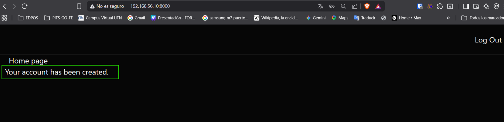
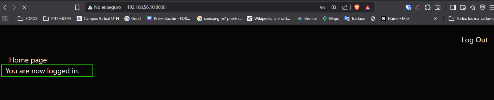

[< Volver al índice](../entregable02.md)

# Episodio 27: Flash Messaging and Interactivity with AlpineJS

En este episodio integré Alpine.js al proyecto para manejar interactividad del lado del cliente, y lo usé para mostrar mensajes flash con animación de desvanecimiento automático.

## Instalación e inicialización de Alpine.js

Alpine.js ya venía como dependencia del proyecto. Lo inicialicé en `resources/js/app.js`:

```javascript
import axios from 'axios';
import Alpine from 'alpinejs';

window.Alpine = Alpine;
Alpine.start();

window.axios = axios;
window.axios.defaults.headers.common['X-Requested-With'] = 'XMLHttpRequest';
```

También agregué `resources/js/app.js` a la directiva `@vite` en el layout para que se cargue en todas las páginas:

```blade
@vite(['resources/css/app.css', 'resources/js/app.js'])
```

## Mensajes flash con Alpine.js

Integré `@session('success')` de Laravel con Alpine.js para mostrar un toast en la esquina inferior derecha que desaparece automáticamente después de 3 segundos:

```blade
@session('success')
    <div
        x-data="{ show: true }"
        x-init="setTimeout(() => show = false, 3000)"
        x-show="show"
        x-transition.opacity.duration.300m
        class="bg-primary px-4 py-3 absolute bottom-4 right-4 rounded-lg"
    >
        {{ $value }}
    </div>
@endsession
```

La combinación de directivas Alpine que usé:
- `x-data` — define el estado local del componente
- `x-init` — ejecuta código al inicializar, en este caso activa el timer de 3 segundos
- `x-show` — controla la visibilidad del elemento según el estado
- `x-transition.opacity.duration.300m` — agrega una transición de opacidad al ocultar el elemento

## Evidencia






<sub>Documentado por Xavier Fernández Zúñiga - ISW-811</sub>