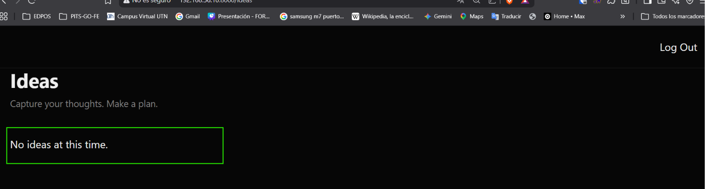
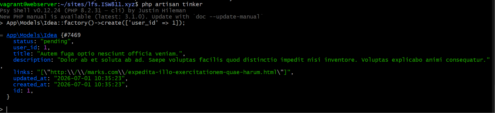
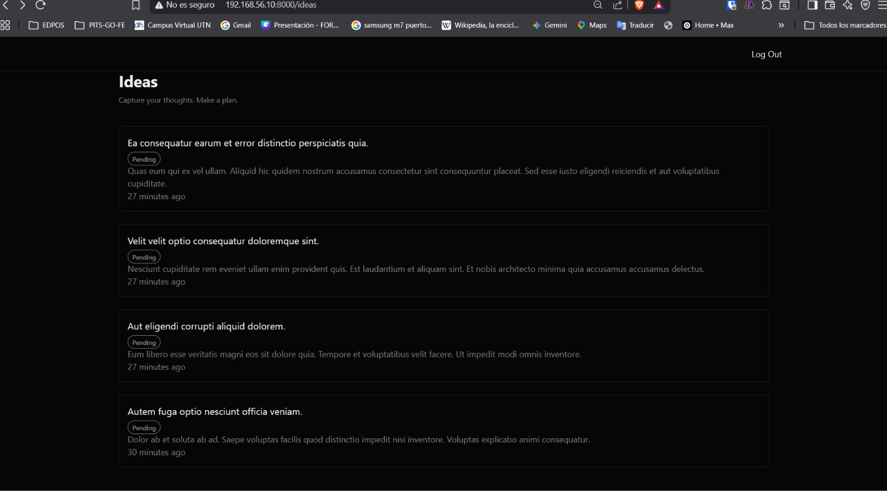

[< Volver al índice](../entregable02.md)

# Episodio 28: Idea Cards

En este episodio construí la vista principal de ideas con un sistema de cards que muestra el título, estado y descripción de cada idea del usuario autenticado.

## Rutas

Agregué las rutas para listar e individual de ideas:

```php
Route::redirect('/', '/ideas');
Route::get('/ideas', [IdeaController::class, 'index'])->middleware('auth');
Route::get('/ideas/{idea}', [IdeaController::class, 'show'])->name('idea.show')->middleware('auth');
```

La ruta raíz redirige a `/ideas`, y ambas rutas están protegidas con middleware `auth`.

## IdeaController

```php
public function index()
{
    $ideas = Auth::user()->ideas()->latest()->get();

    return view('ideas.index', [
        'ideas' => $ideas,
    ]);
}
```

## Vista index


```blade
<x-layout>
    <div>
        <header class="py-8 md:py-12">
            <h1 class="text-3xl font-bold">Ideas</h1>
            <p class="text-muted-foreground text-sm mt-2">Capture your thoughts. Make a plan.</p>
        </header>

        <div class="mt-10 text-muted-foreground">
            <div class="grid md:grid-cols-2 gap-6">
                @forelse($ideas as $idea)
                    <x-card href="{{ route('idea.show', $idea) }}">
                        <h3 class="text-foreground text-lg">{{ $idea->title }}</h3>
                        <div class="mt-1">
                            <x-idea.status-label status="{{ $idea->status }}">
                                {{ $idea->status->label() }}
                            </x-idea.status-label>
                        </div>
                        <div class="mt-5 line-clamp-3">{{ $idea->description }}</div>
                        <div class="mt-4">{{ $idea->created_at->diffForHumans() }}</div>
                    </x-card>
                @empty
                    <x-card>
                        <p>No ideas at this time.</p>
                    </x-card>
                @endforelse
            </div>
        </div>
    </div>
</x-layout>
```

## Componente card

Creé `resources/views/components/card.blade.php` como componente flexible que renderiza un `<a>` si recibe `href` o un `<div>` si no:

```blade
@props(['href' => null])

@if($href)
    <a href="{{ $href }}" {{ $attributes(['class' => 'block border border-border rounded-lg bg-card p-4 md:text-sm hover:border-primary/50 transition-colors']) }}>
        {{ $slot }}
    </a>
@else
    <div {{ $attributes(['class' => 'border border-border rounded-lg bg-card p-4 md:text-sm']) }}>
        {{ $slot }}
    </div>
@endif
```

## Componente status-label

Creé `resources/views/components/idea/status-label.blade.php` para mostrar el estado de la idea con colores según su valor:

```blade
@props(['status' => 'pending'])

@php
    $classes = 'inline-block rounded-full border px-2 py-1 text-xs font-medium';

    if ($status === 'pending') {
        $classes .= ' bg-yellow-500/10 text-yellow-500 border-yellow-500/20';
    }

    if ($status === 'in_progress') {
        $classes .= ' bg-blue-500/10 text-blue-500 border-blue-500/20';
    }

    if ($status === 'completed') {
        $classes .= ' bg-primary/10 text-primary border-primary/20';
    }
@endphp

<span {{ $attributes(['class' => $classes]) }}>
    {{ $slot }}
</span>
```

## Evidencia







<sub>Documentado por Xavier Fernández Zúñiga - ISW-811</sub> 
