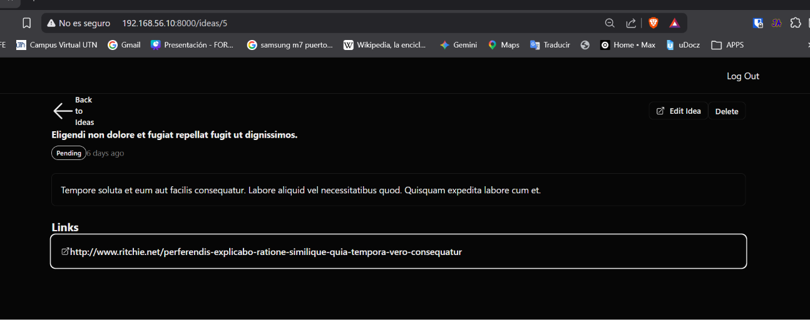

[< Volver al índice](../entregable03.md)

# Episodio 30: Show A Single Idea

En este episodio construí la vista de detalle de una idea individual, mostrando el título, estado, descripción, fecha y links asociados, junto con botones de editar y eliminar.

## Rutas

Agregué el nombre `idea.index` a la ruta existente y la ruta de eliminación:

```php
Route::get('/ideas', [IdeaController::class, 'index'])->name('idea.index')->middleware('auth');
Route::delete('/ideas/{idea}', [IdeaController::class, 'destroy'])->name('idea.destroy')->middleware('auth');
```

## IdeaController

Implementé los métodos `show()` y `destroy()`:

```php
public function show(Idea $idea)
{
    return view('ideas.show', [
        'idea' => $idea,
    ]);
}

public function destroy(Idea $idea)
{
    $idea->delete();
    return to_route('idea.index');
}
```

## Vista show

Creé `resources/views/ideas/show.blade.php` con la estructura completa de detalle como la de Jefrey:

```blade
<x-layout>
    <div class="py-8 max-w-4xl mx-auto">
        <div class="flex justify-between items-center">
            <a href="{{ route('idea.index') }}" class="flex items-center gap-x-2 text-sm font-medium">
                <x-icons.arrow-back />
                Back to Ideas
            </a>

            <div class="gap-x-3 flex items-center">
                <button class="btn btn-outlined">
                    <x-icons.external />
                    Edit Idea
                </button>

                <form method="POST" action="{{ route('idea.destroy', $idea) }}">
                    @csrf
                    @method('DELETE')
                    <button class="btn btn-outlined text-red-500">Delete</button>
                </form>
            </div>
        </div>

        <div class="mt-8 space-y-6">
            <h1 class="font-bold text-4xl">{{ $idea->title }}</h1>

            <div class="mt-2 flex gap-x-3 items-center">
                <x-idea.status-label :status="$idea->status->value">{{ $idea->status->label() }}</x-idea.status-label>
                <div class="text-muted-foreground text-sm">{{ $idea->created_at->diffForHumans() }}</div>
            </div>

            <x-card class="mt-6 space-y-3">
                <div class="text-foreground max-w-none cursor-pointer">{{ $idea->description }}</div>
            </x-card>

            @if ($idea->links->count())
                <div>
                    <h3 class="font-bold text-xl mt-6">Links</h3>
                    <div class="mt-3">
                        @foreach ($idea->links as $link)
                            <x-card :href="$link" class="text-primary font-medium flex gap-x-3 items-center">
                                <x-icons.external />
                                {{ $link }}
                            </x-card>
                        @endforeach
                    </div>
                </div>
            @endif
        </div>
    </div>
</x-layout>
```

## Componentes de iconos

Creé la carpeta `resources/views/components/icons/` con cuatro iconos SVG reutilizables:

- `arrow-back.blade.php` — flecha de retorno
- `external.blade.php` — ícono de enlace externo
- `trash.blade.php` — ícono de eliminar
- `close.blade.php` — ícono de cerrar

## Evidencia



<sub>Documentado por Xavier Fernández Zúñiga - ISW-811</sub>