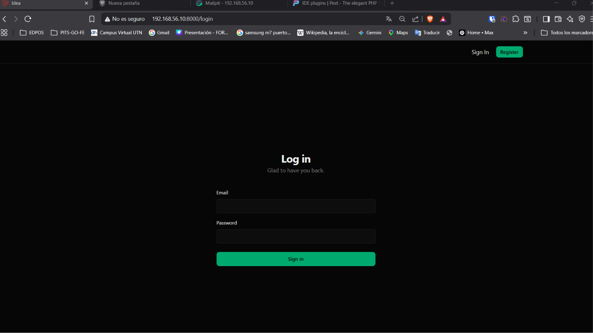
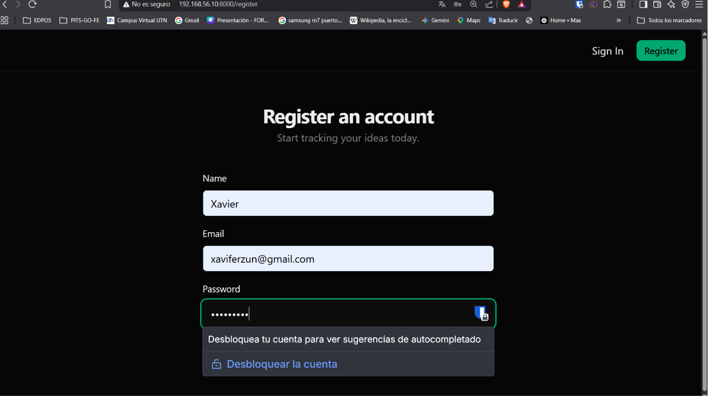
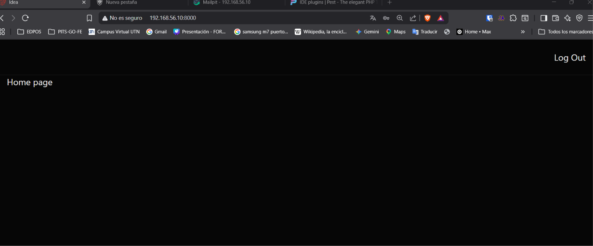
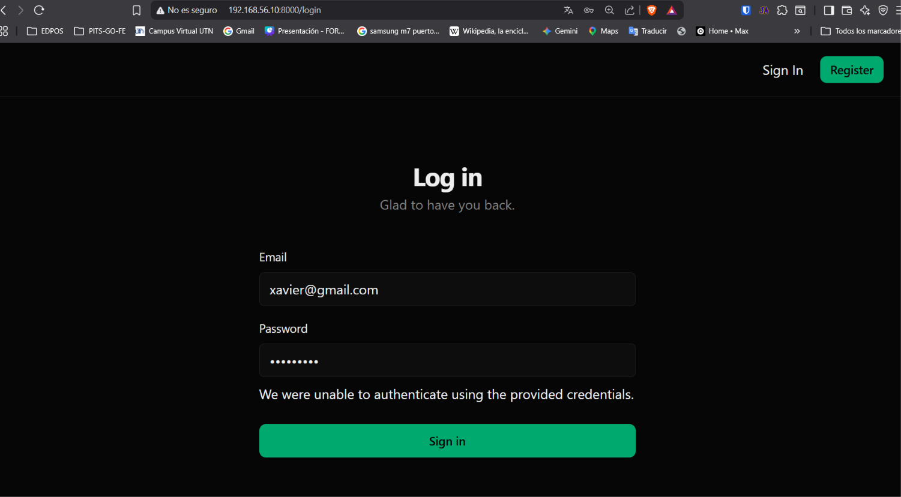

[< Volver al índice](../entregable02.md)

# Episodio 25: Tailwind Theme Setup And Initial UI

En este episodio hice la autenticación y el tema visual del proyecto usando Tailwind, separando los estilos en archivos de componentes y creando un layout reutilizable.

## Tema con Tailwind v4

Definí una paleta de colores igual a la de Jefrey oscura usando `@theme` en `app.css`, con variables CSS personalizadas para fondo, texto, tarjetas, colores primarios y bordes:

```css
@theme {
    --color-background: oklch(0.12 0 0);
    --color-foreground: oklch(0.95 0 0);
    --color-card: oklch(0.16 0 0);
    --color-primary: oklch(0.65 0.15 160);
    --color-primary-foreground: oklch(0.12 0 0);
    --color-border: oklch(0.24 0 0);
    --color-input: oklch(0.24 0 0);
    --color-muted-foreground: oklch(0.6 0 0);
}
```

También separé los estilos de botones e inputs en archivos dedicados importados como capas de componentes:

```css
@import './components/btn.css' layer(components);
@import './components/form.css' layer(components);
```

## Layout base y navegación

Creé `resources/views/components/layout/layout.blade.php` como el componente raíz que envuelve todas las páginas, cargando los assets con `@vite` e incluyendo la barra de navegación.

`nav.blade.php` usa `@auth` y `@guest` para mostrar opciones distintas según el estado del usuario:

```blade
@auth
    <form method="POST" action="/logout">
        @csrf
        <button>Log Out</button>
    </form>
@endauth

@guest
    <a href="/login">Sign In</a>
    <a href="/register" class="btn">Register</a>
@endguest
```

## Componentes de formulario reutilizables

Creé `form.blade.php` como el "card" centrado con título y descripción, y `form/field.blade.php` como el componente de campo con label, input y manejo de errores de validación:

```blade
@props(['label', 'name', 'type' => 'text'])

<div class="space-y-2">
    <label for="{{ $name }}" class="label">{{ $label }}</label>
    <input type="{{ $type }}" class="input" id="{{ $name }}" name="{{ $name }}"
           value="{{ old($name) }}" {{ $attributes }}>

    @error($name)
        <p class="error">{{ $message }}</p>
    @enderror
</div>
```


## Controllers de autenticación

`RegisteredUserController` maneja el registro:

```php
public function store(Request $request)
{
    $attributes = $request->validate([
        'name' => ['required', 'string', 'max:255'],
        'email' => ['required', 'string', 'email', 'max:255', 'unique:users'],
        'password' => ['required', 'string', 'min:8', 'max:255'],
    ]);

    $user = User::create($attributes);
    Auth::login($user);

    return redirect('/')->with('success', 'Your account has been created.');
}
```

`SessionsController` maneja el login y logout:

```php
public function store(Request $request)
{
    $attributes = $request->validate([
        'email' => ['required', 'string', 'email', 'max:255'],
        'password' => ['required', 'string', 'min:8', 'max:255'],
    ]);

    if (! Auth::attempt($attributes)) {
        return back()
            ->withErrors(['password' => 'We were unable to authenticate using the provided credentials.'])
            ->withInput();
    }

    $request->session()->regenerate();

    return redirect()->intended('/')->with('success', 'You are now logged in.');
}

public function destroy()
{
    Auth::logout();
    return redirect('/');
}
```

## Rutas

Las rutas de autenticación están protegidas con middleware `guest` o `auth` según corresponda:

```php
Route::get('/register', [RegisteredUserController::class, 'create'])->middleware('guest');
Route::post('/register', [RegisteredUserController::class, 'store'])->middleware('guest');

Route::get('/login', [SessionsController::class, 'create'])->middleware('guest');
Route::post('/login', [SessionsController::class, 'store'])->middleware('guest');

Route::post('/logout', [SessionsController::class, 'destroy'])->middleware('auth');
```

## Compilación de assets

Como proyecto nuevo, los assets de Vite no estaban compilados. Los instalé y compilé:

```bash
npm install
npm run build
```

## Evidencia










<sub>Documentado por Xavier Fernández Zúñiga - ISW-811</sub>