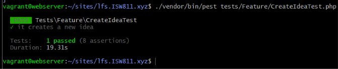

[< Volver al índice](../entregable03.md)

# Episodio 33 - Test The Create Idea Form

En este episodio escribí una prueba para verificar que el formulario de creación de ideas funciona correctamente, ademas que un usuario autenticado puede enviar el formulario y que la idea queda registrada en la base de datos con los datos correctos.

## Adaptación por limitación de PHP

El profesor Jeffrey escribe este test usando el plugin `pestphp/pest-plugin-browser`, que simula un navegador real (`visit()`, `click()`, `fill()`) y lo ubica en `tests/browser/`. Ese plugin requiere PHP ^8.3, y mi entorno tiene PHP 8.2.31, una limitación que ya documenté en episodios anteriores y que no pude resolver actualizando el proyecto por restricciones del entorno.

En lugar de omitir el test investigué y lo adapté como un **Feature Test** estándar de Laravel, que no depende del plugin de navegador: en vez de simular clics, envío directamente una petición HTTP con los datos del formulario y verifico el resultado en la base de datos. El objetivo de la prueba (confirmar que el formulario crea la idea con los datos correctos) se mantiene igual.

```php
<?php

use App\Models\User;

it('creates a new idea', function () {
    $user = User::factory()->create();

    $this->actingAs($user)
        ->post('/ideas', [
            'title' => 'Some Example Title',
            'status' => 'completed',
            'description' => 'An example description',
        ])
        ->assertRedirect('/ideas');

    expect($user->ideas()->first())->toMatchArray([
        'title' => 'Some Example Title',
        'status' => 'completed',
        'description' => 'An example description',
    ]);
});
```

Este archivo lo ubiqué en `tests/Feature/CreateIdeaTest.php`, dejando `tests/browser/` reservado para cuando eventualmente pueda actualizar el entorno a PHP 8.3 y usar el plugin original tal como lo muestra el curso.

## Data-test attributes

Aunque no use el plugin de browser testing, mantuve los atributos `data-test` que agregó el profesor en `index.blade.php`, ya que documentan la intención original y quedarían listos si en el futuro habilito el testing con navegador real:

```blade
<x-card 
    x-data
    @click="$dispatch('open-modal', 'create-idea')"
    is="button"
    type="button"
    data-test="create-idea-button"
    class="mt-10 cursor-pointer h-32 w-full text-left"
>
    <p>What's the idea?</p>
</x-card>
```

```blade
<button
    type="button"
    @click="status = @js($status->value)"
    data-test="status-{{ $status->value }}"
    class="btn flex-1 h-10"
    :class="{'btn-outlined': status !== @js($status->value)}"
>
    {{ $status->label() }}
</button>
```

## Evidencia



## Problema encontrado

Al correr el test recién adaptado, obtuve el error `RuntimeException: A facade root has not been set`, lanzado desde `UserFactory.php` al intentar crear el usuario de prueba. El error no tenía relación con la lógica del test en sí, sino con la configuración de Pest.

Revisando `tests/Pest.php`, encontré que el bootstrap de Laravel (`Tests\TestCase` con `RefreshDatabase`) solo se aplicaba a las carpetas `Browser` y `Unit`:

```php
pest()->extend(Tests\TestCase::class)
    ->use(Illuminate\Foundation\Testing\RefreshDatabase::class)
    ->in('Browser', 'Unit');
```

Como creé mi test en una carpeta nueva Feature, esta no estaba incluida en el `->in(...)`, por lo que Pest ejecutaba el test con el TestCase genérco de PHPUnit, sin inicializar la aplicación de Laravel ni facades. La solución fue agregar `'Feature` a la lista:

```php
pest()->extend(Tests\TestCase::class)
    ->use(Illuminate\Foundation\Testing\RefreshDatabase::class)
    ->in('Browser', 'Feature', 'Unit');
```

Con ese cambio, el test corrió correctamente.

<sub>Documentado por Xavier Fernández Zúñiga - ISW-811</sub>