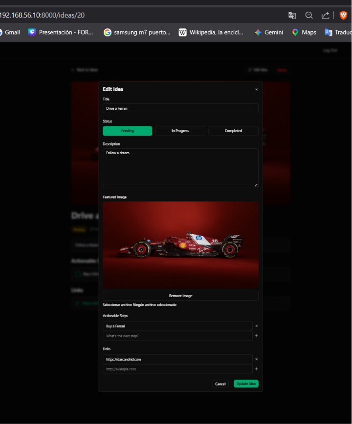

[< Volver al índice](../entregable03.md)

# Episodio 39 - The Edit Idea Modal

En este episodio construí el modal de edición de ideas, reutilizando la mayor parte del formulario que ya tenía para la creación siguiendo la explicacion de Jefrey. Extraje el modal a su propio componente para evitar duplicar todo el markup entre "crear" y "editar", precargando los campos con los datos existentes de la idea cuando corresponde.

## Componente unificado `x-idea.modal`

Convertí el modal en un componente que recibe una idea opcional. Si la idea ya existe (tiene un `id`), el modal se comporta como edición; si no, como creación:

```blade
@props(['idea' => new App\Models\Idea()])

<x-modal name="{{ $idea->exists ? 'edit-idea' : 'create-idea' }}" title="{{ $idea->exists ? 'Edit Idea' : 'New Idea' }}">
    <form
        x-data="{
            status: @js(old('status', $idea->status->value)),
            links: @js(old('links', $idea->links)),
            newLink: '',
            steps: @js(old('steps', $idea->steps->map(fn($step) => $step->description))),
            newStep: '',
        }"
        method="POST"
        action="{{ $idea->exists ? route('idea.update', $idea) : route('idea.store') }}"
        enctype="multipart/form-data"
    >
        @csrf

        @if ($idea->exists)
            @method('PATCH')
        @endif

        {{-- ... resto de los campos, cada uno con :value="$idea->campo ?? ''" para precargar ... --}}
    </form>

    @if ($idea->image_path)
        <form method="POST" action="{{ route('idea.image.destroy', $idea) }}" id="delete-image-form">
            @csrf
            @method('DELETE')
        </form>
    @endif
</x-modal>
```

Cada campo usa `old('campo', $idea->campo)` para que, si la validación falla, se conserve lo que el usuario escribió, y si no hay error, se precargue con el valor actual de la idea.

## Reutilización del modal en `index.blade.php` y `show.blade.php`

En `index.blade.php`, el modal de creación ahora es simplemente:
```blade
<x-idea.modal/>
```

Y en `show.blade.php`, se le pasa la idea actual para que actúe como edición:
```blade
<x-idea.modal :idea="$idea"/>
```

## Botón "Edit Idea" en `show.blade.php`

```blade
<button
    x-data
    @click="$dispatch('open-modal', 'edit-idea')"
    class="btn btn-outlined"
    data-test="edit-idea-button"
>
    <x-icons.external />
    Edit Idea
</button>
```

## Eliminar la imagen destacada (`IdeaImageController`)

Agregué un controlador dedicado solo para eliminar la imagen de una idea sin afectar el resto de sus datos:

```php
class IdeaImageController extends Controller
{
    public function destroy(Idea $idea)
    {
        Gate::authorize('workWith', $idea);

        Storage::disk('public')->delete($idea->image_path);

        $idea->update(['image_path' => null]);

        return back();
    }
}
```

```php
Route::delete('/ideas/{idea}/image', [IdeaImageController::class, 'destroy'])->name('idea.image.destroy')->middleware('auth');
```

## Renombre de `StoreIdeaRequest` a `IdeaRequest`

Como ahora el mismo Form Request se usa tanto para crear como para actualizar, renombré el archivo y la clase de `StoreIdeaRequest` a `IdeaRequest`, y eliminé el `UpdateIdeaRequest` que ya no hacía falta.

## Ruta de actualización

```php
Route::patch('/ideas/{idea}', [IdeaController::class, 'update'])->name('idea.update')->middleware('auth');
```

## Evidencia




<sub>Documentado por Xavier Fernández Zúñiga - ISW-811</sub>