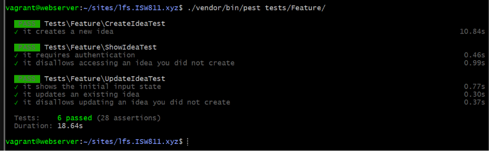
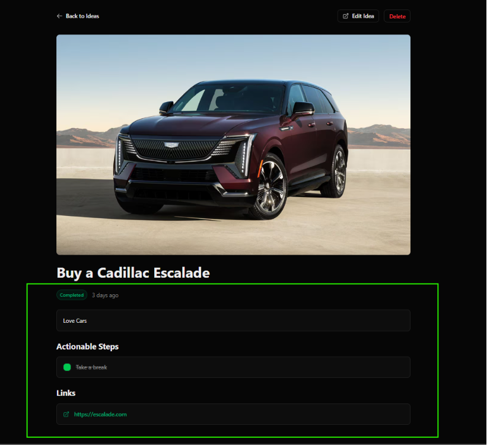

[< Volver al índice](../entregable03.md)

# Episodio 40 - Update Idea Action

En este episodio implementé la lógica real de actualización de ideas, completando el método `update()` del controlador (que en el episodio anterior solo autorizaba, sin persistir cambios) mediante una nueva Action Class `UpdateIdea`, siguiendo el mismo patrón que `CreateIdea`.

## Action Class `UpdateIdea`

```php
class UpdateIdea
{
    public function handle(array $attributes, Idea $idea)
    {
        $data = collect($attributes)->only([
            'title', 'description', 'status', 'links',
        ])->toArray();

        if ($attributes['image'] ?? false) {
            $data['image_path'] = $attributes['image']->store('ideas', 'public');
        }

        DB::transaction(function () use ($idea, $data, $attributes) {
            $idea->update($data);

            $idea->steps()->delete();

            $idea->steps()->createMany($attributes['steps'] ?? []);
        });
    }
}
```

A diferencia de una sincronización más compleja por `id`, esta estrategia elimina todos los steps existentes y los vuelve a crer on lo que llega del formulario en cada actualización.

## Formulario con soporte para editar steps existentes

El formulario ahora envía cada step como un objeto (con `description` y `completed`) en vez de un string plano, para poder representar tanto steps nuevos como existentes con su estado de completado:

```blade
<template x-for="(step, index) in steps" :key="step.id || index">
    <div class="flex gap-x-2 items-center">
        <input name="steps[${index}][description]" x-model="step.description" class="input" readonly>
        <input type="hidden" :name="steps[${index}][completed]" x-model="step.completed ? '1' : '0'" class="input" readonly>
        <button type="button" aria-label="Remove step" @click="steps.splice(index, 1)" class="form-muted-icon">
            <x-icons.close />
        </button>
    </div>
</template>
```

Y la validación en `IdeaRequest` se actualizó acorde a este nuevo formato:

```php
'steps.*.description' => ['string', 'max:255'],
'steps.*.completed' => ['boolean'],
```

## Controlador

```php
public function update(IdeaRequest $request, Idea $idea, UpdateIdea $action)
{
    Gate::authorize('workWith', $idea);

    $action->handle($request->safe()->all(), $idea);

    return to_route('idea.show', $idea)->with('success', 'Idea updated successfully.');
}
```

## Tests adaptados (`tests/Feature/UpdateIdeaTest.php`)

```php
it('shows the initial input state', function () {
    $user = User::factory()->create();
    $idea = Idea::factory()->for($user)->create();

    $this->actingAs($user)
        ->get(route('idea.show', $idea))
        ->assertSee($idea->title)
        ->assertSee($idea->description);
});

it('updates an existing idea', function () {
    $user = User::factory()->create();
    $idea = Idea::factory()->for($user)->create([...]);

    $this->actingAs($user)
        ->patch(route('idea.update', $idea), [...])
        ->assertRedirect(route('idea.show', $idea));

    $idea->refresh();

    expect($idea)->toMatchArray([...]);
    expect($idea->steps)->toHaveCount(2);
});

it('disallows updating an idea you did not create', function () {
    $user = User::factory()->create();
    $this->actingAs($user);

    $idea = Idea::factory()->create();

    $this->patch(route('idea.update', $idea), [...])->assertForbidden();
});
```

## Evidencia







<sub>Documentado por Xavier Fernández Zúñiga - ISW-811</sub>