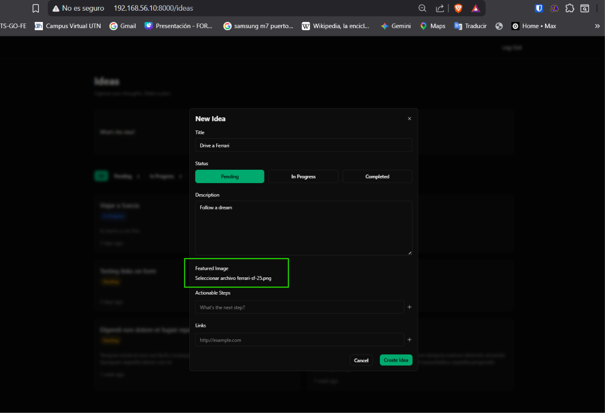
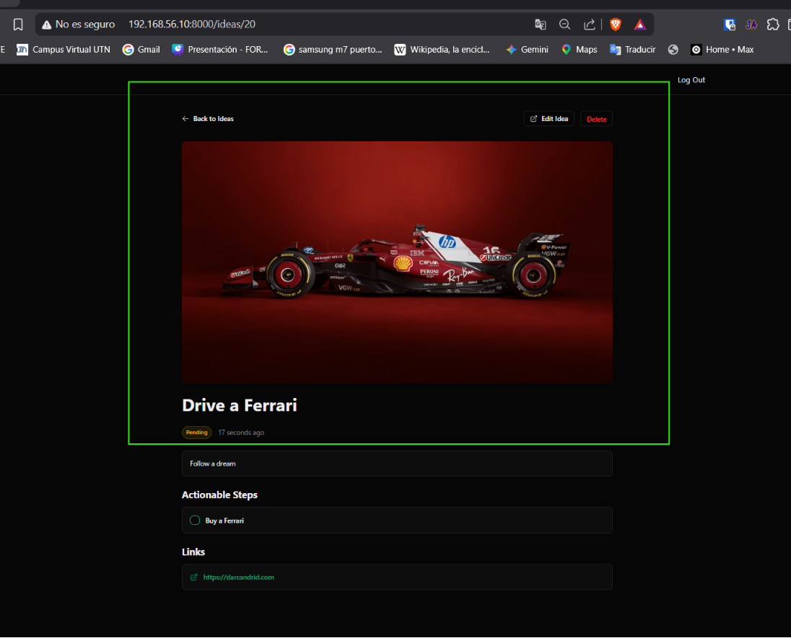
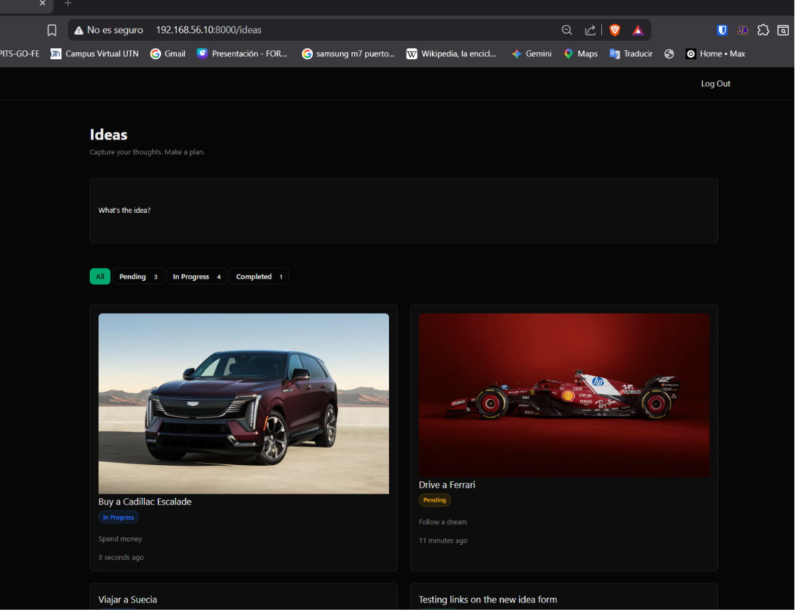

[< Volver al índice](../entregable03.md)

# Episodio 36 - Upload Featured Images To Storage

En este episodio agregué la opcion de subir una imagen al crear una idea, usando el sistema de almacenamiento de archivos de Laravel, y la mostré tanto en la vista individual de la idea como en las tarjetas de la pantalla principal.

## Symlink de almacenamiento público

Antes de guardar cualquier archivo, confirmé que el enlace entre `public/storage` y `storage/app/public` ya existía en el proyecto:

```bash
php artisan storage:link
```

## Campo de imagen en el formulario (`index.blade.php`)

Agregué el input de tipo archivo dentro del formulario de creación, y le agregué el atributo `enctype="multipart/form-data"` al `<form>`, para que el navegador envíe archivos correctamente:

```blade
<form
    x-data="{...}"
    method="POST"
    action="{{ route('idea.store') }}"
    enctype="multipart/form-data"
>
```

```blade
<div class="space-y-2">
    <label for="image" class="label">Featured Image</label>

    <input type="file" name="image" accept="image/*">
    <x-form.error name="image" />
</div>
```

## Validación de la imagen (`StoreIdeaRequest`)

```php
'image' => ['nullable', 'image', 'max:5120'], //Jefrey uso ese valor
```

## Guardar el archivo en storage (`IdeaController`)

El campo `image` que llega del formulario no es una columna de la tabla `ideas` (la columna real es `image_path`), así que tuve que excluirlo del array que va directo a `create()` y guardar el archivo físico por separado, asignando la ruta resultante a `image_path`:

```php
public function store(StoreIdeaRequest $request)
{
    $idea = Auth::user()->ideas()->create([
        ...$request->safe()->except(['steps', 'image']),
        'image_path' => $request->file('image')?->store('idea-images', 'public'),
    ]);

    foreach ($request->validated('steps', []) as $step) {
        $idea->steps()->create(['description' => $step]);
    }

    return to_route('idea.index')->with('success', 'Idea created successfully.');
}
```

`store('idea-images', 'public')` guarda el archivo en `storage/app/public/idea-images/` con un nombre generado automáticamente, y devuelve la ruta relativa que se guarda en `image_path`. El operador `?->` evita errores si no se subió ninguna imagen.

## Mostrar la imagen en la vista individual (`show.blade.php`)

```blade
@if ($idea->image_path)                
    image_path) }}" alt="" class="rounded-lg w-full max-h-96 object-cover">
@endif
```

## Mostrar la imagen en las tarjetas de la pantalla principal (`index.blade.php`)

```blade
<x-card href="{{ route('idea.show', $idea) }}">
    @if($idea->image_path)
        <div class="mb-4 -mx-4 -mt-4 rounded-t-lg overflow-hidden">
            image_path) }}" alt="{{ $idea->title }}" class="w-full h-48 object-cover">
        </div>
    @endif

    <h3 class="text-foreground text-lg">{{ $idea->title }}</h3>
    ...
</x-card>
```

Los márgenes negativos (`-mx-4 -mt-4`) hacen que la imagen ocupe todo el ancho de la tarjeta, ignorando el padding interno del componente `x-card`, para que se vea como una imagen de portada completa.

## Evidencia







<sub>Documentado por Xavier Fernández Zúñiga - ISW-811</sub>