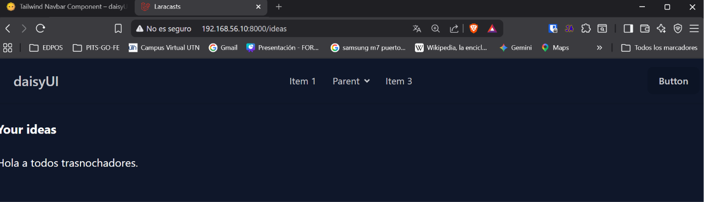
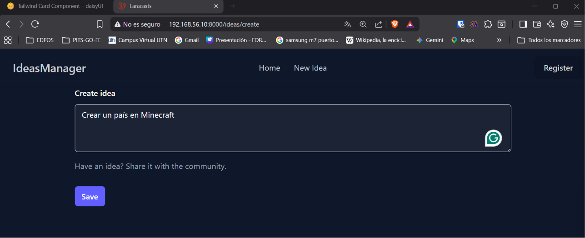
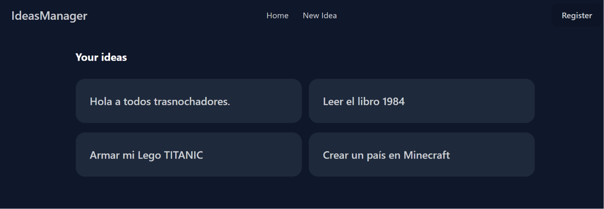
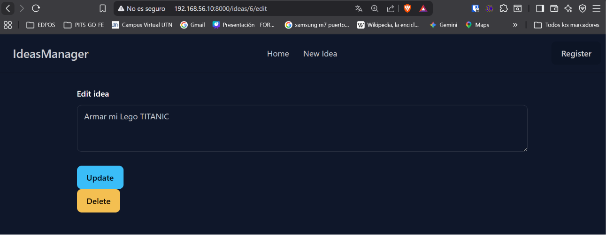
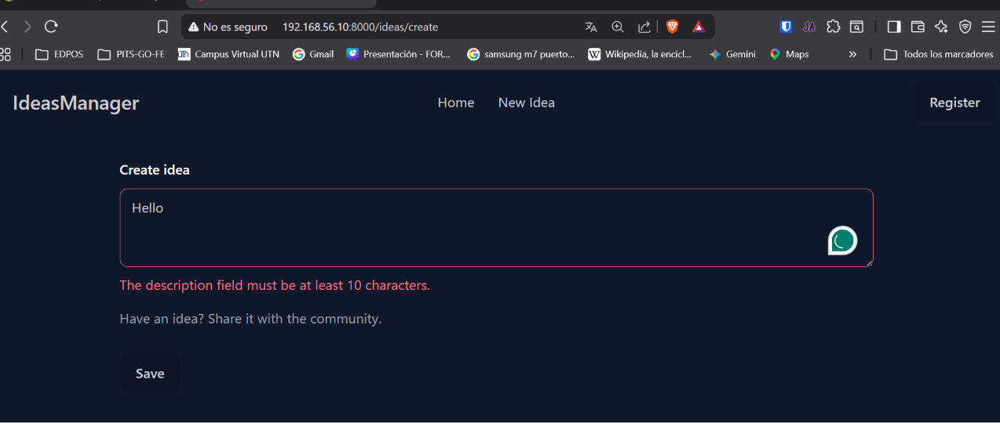

[< Volver al índice](../entregable01.md)

# Episodio 13: A Brief DaisyUI Detour

En este episodio reemplacé los estilos de Tailwind que tenia por DaisyUI, un plugin de componentes que permitió usar componentes ya armados como `btn`, `card`, `textarea` y `navbar`.

Agregué el CDN de DaisyUI junto al de Tailwind en el layout principal:

```php
<link href="https://cdn.jsdelivr.net/npm/daisyui@5" rel="stylesheet" type="text/css" />
<script src="https://cdn.jsdelivr.net/npm/@tailwindcss/browser@4"></script>
<link href="https://cdn.jsdelivr.net/npm/daisyui@5/themes.css" rel="stylesheet" type="text/css" />
```

Tomé el componente de navegación de la documentación oficial de DaisyUI tal como en el video de Laracasts, y lo adapté a mi proyecto, moviendolo a su propio componente Blade (`nav.blade.php`) con los links reales para mi caso:

```php
<div class="navbar bg-base-100 shadow-sm">
    <div class="navbar-start">
        <a class="btn btn-ghost text-xl">IdeasManager</a>
    </div>
    <div class="navbar-center hidden lg:flex">
        <ul class="menu menu-horizontal px-1">
            <li><a href="/ideas">Home</a></li>
            <li><a href="/ideas/create">New Idea</a></li>
        </ul>
    </div>
    <div class="navbar-end">
        <a class="btn">Register</a>
    </div>
</div>
```

Para el listado usé `card` de DaisyUI y lo extraje a un nuevo componente `x-idea-card` que recibe el slot con la descripción y un `href` para envolver toda la tarjeta en un link:

```php
<a {{ $attributes->merge(['class' => 'card bg-neutral text-neutral-content w-96']) }}>
    <div class="card-body">
        <h2 class="card-title">{{ $slot }}</h2>
    </div>
</a>
```

```php
@foreach ($ideas as $idea)
    <x-idea-card href="/ideas/{{ $idea->id }}">
        {{ $idea->description }}
    </x-idea-card>
@endforeach
```

También reemplacé las clases de botones que tenía por las clases semanticas de DaisyUI, que ya incluyen color y estados:

```php
<button type="submit" class="btn btn-primary">Update</button>
<button type="submit" class="btn btn-warning">Delete</button>
```

Finalmente agregué una clase condicional con `@error` directamente en el `<textarea>` para que se vea rojo si terenmos algun error de validación.

```php
<textarea class="textarea w-full @error('description') textarea-error @enderror"></textarea>
```

## Evidencia











<sub>Documentado por Xavier Fernández Zúñiga - ISW-811</sub>