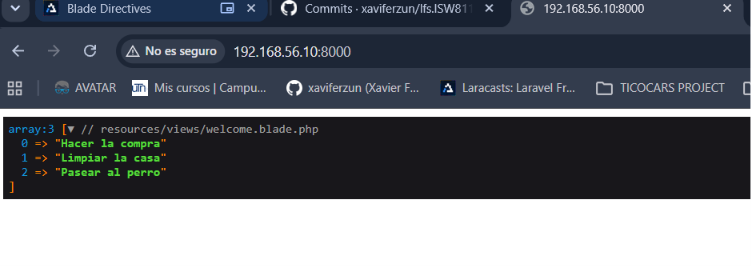
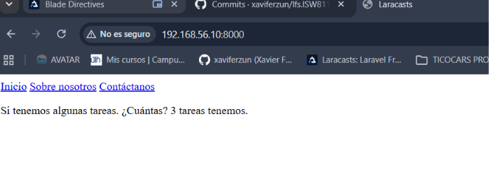
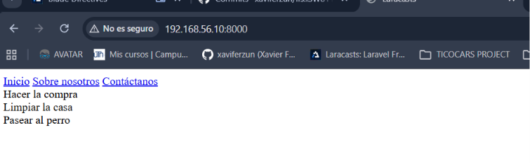

[< Volver al índice](../entregable01.md)

# Episodio 06: Blade Directives

En este episodio exploré las directivas de Blade, que son una forma más limpia de escribir lógica de control dentro de las vistas, en comparación con usar etiquetas PHP puras.

## Depuración con @dd

Primero usé `@dd()` para inspeccionar una variable directamente desde la vista, sin necesidad de hacerlo desde la ruta o el controlador:

```php
<x-layout>
    @dd($tasks)
    <h1>Welcome to Task Manager</h1>
</x-layout>
```

En `routes/web.php` definí un arreglo de tareas de ejemplo:

```php
Route::get('/', function () {
    return view('welcome', [
        'tasks' => [
            'Hacer la compra',
            'Limpiar la casa',
            'Pasear al perro',
        ],
    ]);
});
```



## PHP puro vs. directivas Blade

Antes de usar las directivas de Blade, probé escribir la misma lógica con etiquetas PHP completas, para entender qué problema resuelven las directivas:

```php
<x-layout>
    <?php if (count($tasks)): ?>
        <p>Si tenemos algunas tareas. ¿Cuántas? <?= count($tasks) ?> tareas tenemos.</p>
    <?php endif; ?>
</x-layout>
```



Luego reescribí exactamente la misma lógica usando las directivas `@if` y `@endif`, mucho más legibles dentro del HTML:

```php
<x-layout>
    @if (count($tasks))
        <p>Si tenemos algunas tareas. ¿Cuántas? <?= count($tasks) ?> tareas tenemos.</p>
    @endif
</x-layout>
```

## @forelse

Para recorrer la lista de tareas, usé `@forelse`, que combina el recorrido de un arreglo con el manejo automático del caso en que esté vacío, sin necesitar un `@if` adicional:

```php
<x-layout>
    @forelse($tasks as $task)
        <li>{{ $task }}</li>
    @empty
        <p>No tenemos tareas.</p>
    @endforelse
</x-layout>
```



## @can

Por últim vi un ejemplo conceptual de la directiva `@can`, usada para verificar permisos de autorización antes de mostrar contenido (por ejemplo, un enlace de edición visible solo si el usuario tiene permiso):

```php
<x-layout>
    @can('edit', $post)
        <a href="posts/1/edit">Editar Post</a>
    @endcan
</x-layout>
```

<sub>Documentado por Xavier Fernández Zúñiga - ISW-811</sub>