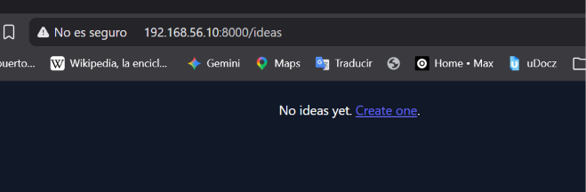
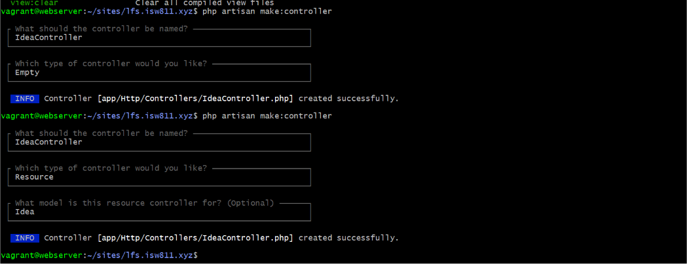

[< Volver al índice](../entregable01.md)

# Episodio 10: Controllers

En este episodio moví toda la lógica que tenía repartida dentro de `web.php` hacia un controlador organizando cada acción según la convención de Resource Controllers de Laravel.

Antes de crear el controlador, agregué la ruta para mostrar el formulario de creación de una idea, y un mensaje en el listado para cuando no hay ideas todavía:

```php
Route::get('/ideas/create', function () {
    return view('ideas.create');
});
```

```php
@if ($ideas->count())
    <!-- listado de ideas -->
@else
    <p class="mt-6 text-white">No ideas yet. <a href="/ideas/create">Create one</a>.</p>
@endif
```

Para generar el controlador con los siete metodos estandar de un recurso REST, usé:

```bash
php artisan make:controller IdeaController --resource
```

Esto crea automáticamente la estructura con `index`, `create`, `store`, `show`, `edit`, `update` y `destroy`, cada uno mapeado a una combinación de verbo HTTP y URL. Después fui moviendo la lógica que ya tenía escrita en cada closure de `web.php` al método correspondiente:

```php
class IdeaController extends Controller
{
    public function index()
    {
        $ideas = Idea::all();
        return view('ideas/index', ['ideas' => $ideas]);
    }

    public function create()
    {
        return view('ideas.create');
    }

    public function store(Request $request)
    {
        Idea::create([
            'description' => request('description'),
            'state' => 'pending',
        ]);
        return redirect('/ideas');
    }

    public function show(Idea $idea)
    {
        return view('ideas.show', ['idea' => $idea]);
    }

    public function edit(Idea $idea)
    {
        return view('ideas.edit', ['idea' => $idea]);
    }

    public function update(Request $request, Idea $idea)
    {
        $idea->update(['description' => request('description')]);
        return redirect('/ideas/' . $idea->id);
    }

    public function destroy(Idea $idea)
    {
        $idea->delete();
        return redirect('/ideas');
    }
}
```

Y en `web.php`, cada ruta pasó de ejecutar un closure a apuntar directamente a un método del controlador:

```php
use App\Http\Controllers\IdeaController;

Route::get('/ideas', [IdeaController::class, 'index']);
Route::get('/ideas/create', [IdeaController::class, 'create']);
Route::post('/ideas', [IdeaController::class, 'store']);
Route::get('/ideas/{idea}', [IdeaController::class, 'show']);
Route::get('/ideas/{idea}/edit', [IdeaController::class, 'edit']);
Route::patch('/ideas/{idea}/edit', [IdeaController::class, 'update']);
Route::delete('/ideas/{idea}', [IdeaController::class, 'destroy']);
```

## Evidencia






Este episodio fue util para comprender la funcionalidad de los controladores. A este punto el archivo `web.php` se estaba volviendo difícil de leer con tanta lógica mezclada directo en las rutas. Mover cada acción a su propio método siguiendo el mismo patrón de nombres como `index`, `create`, `store`, `show`, `edit`, `update`, `destroy`, hace que se pueda entender mas facilmente qué hace cada parte sin tener que leer todo el archivo de rutas.

<sub>Documentado por Xavier Fernández Zúñiga - ISW-811</sub>