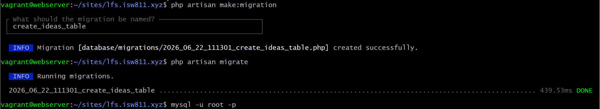
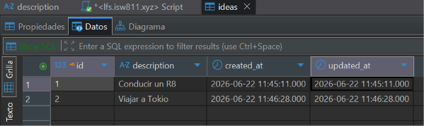
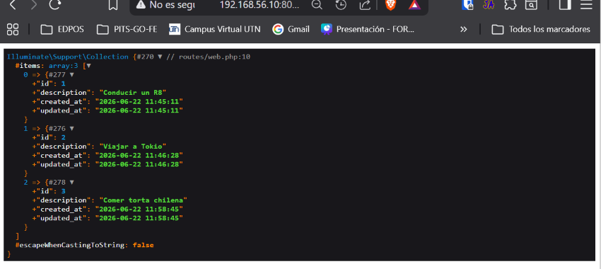
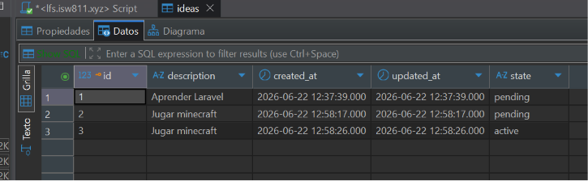
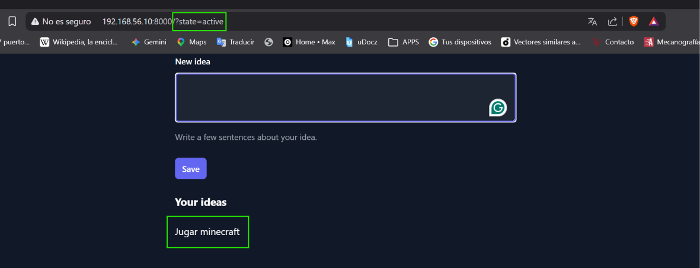

[< Volver al índice](../entregable01.md)

# Episodio 08: Databases, Migrations, and Eloquent

En este episodio guardo las ideas de la sesion en una base de datos, usando migraciones para definir la estructura de la tabla y Eloquent para leer y escribir los datos desde el código.

El video usa SQLite pero mi proyecto ya estaba configurado desde el principio con MariaDB así que seguí trabajando sobre mi propia base.

Empecé creando la migración de la tabla `ideas`:

```bash
php artisan make:migration create_ideas_table
```

```php
public function up(): void
{
    Schema::create('ideas', function (Blueprint $table) {
        $table->id();
        $table->text('description');
        $table->timestamps();
    });
}

public function down(): void
{
    Schema::dropIfExists('ideas');
}
```

Y la corrí con:

```bash
php artisan migrate
```

Para agregar el campo `state` aprendí que en Laravel no se edita una migración ya ejecutada, sino qur se crea una migración nueva que modifica la tabla existente con `Schema::table()` en vez de `Schema::create()`:

```php
Schema::table('ideas', function (Blueprint $table) {
    $table->string('state');
});
```

Usé primero el query builder:

```php
$ideas = DB::table('ideas')->get();
```

Esto devuelve una `Illuminate\Support\Collection` con los registros. Después creé el modelo Eloquent:

```bash
php artisan make:model Idea
```

```php
class Idea extends Model
{
    protected $guarded = [];
}
```

`protected $guarded = []` le dice a Eloquent que ningún campo está protegido contra asignación masiva, así que puedo usar `Idea::create([...])` con cualquier campo. Con el modelo ya creado, reemplacé el query builder por la sintaxis de Eloquent:

```php
Route::get('/', function () {
    $ideas = Idea::query()
        ->when(request('state'), function ($query, $state) {
            $query->where('state', $state);
        })
        ->get();

    return view('ideas', [
        'ideas' => $ideas,
    ]);
});

Route::post('/ideas', function () {
    Idea::create([
        'description' => request('idea'),
        'state' => 'pending',
    ]);
    return redirect('/');
});
```


En la vista ajusté el `@foreach` para acceder a las propiedades del modelo en vez de un array plano:

```php
@if ($ideas->count())
    <div class="mt-6 text-white">
        <h2 class="font-bold text-lg text-white">Your ideas</h2>
        <ul class='mt-6'>
            @foreach ($ideas as $idea)
                <li class="text-small">{{ $idea->description }}</li>
            @endforeach
        </ul>
    </div>
@endif
```

## Evidencia












<sub>Documentado por Xavier Fernández Zúñiga - ISW-811</sub>