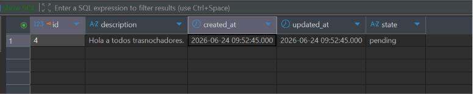
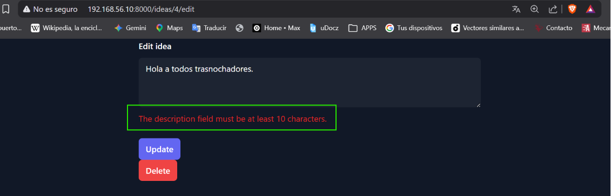

[< Volver al índice](../entregable01.md)

# Episodio 12: Form Request Classes

En este episodio extraje la lógica de validación que tenía directo en el controlador hacia una clase dedicada de tipo Form Request, para mantener el controlador más limpio y reutilizar las mismas reglas tanto al crear como al editar una idea.

Generé la clase con:

```bash
php artisan make:request StoreIdeaRequest
```

Y luego, siguiendo el video, la renombré a (`IdeaRequest`), ya que la misma clase sirve tanto para `store` como para `update`:

```php
class IdeaRequest extends FormRequest
{
    public function authorize(): bool
    {
        return true;
    }

    public function rules(): array
    {
        return [
            'description' => ['required', 'min:10'],
        ];
    }

    public function messages(): array
    {
        return [
            'description.required' => 'Please provide a description for your idea.',
        ];
    }
}
```

En el controlador, reemplacé el `Request $request` genérico por la clase específica en ambos métodos relacionados con el formulario:

```php
use App\Http\Requests\IdeaRequest;

public function store(IdeaRequest $request)
{
    Idea::create([
        'description' => request('description'),
        'state' => 'pending',
    ]);
    return redirect('/ideas');
}

public function update(IdeaRequest $request, Idea $idea)
{
    $idea->update([
        'description' => request('description'),
    ]);
    return redirect('/ideas/' . $idea->id);
}
```

Con solo cambiar el tipo del parámetro, Laravel valida automáticamente la request antes de que el código del método se ejecute, usando las reglas definidas en `IdeaRequest::rules()` — ya no hace falta llamar a `request()->validate(...)` manualmente dentro de cada método.

## Evidencia






<sub>Documentado por Xavier Fernández Zúñiga - ISW-811</sub>