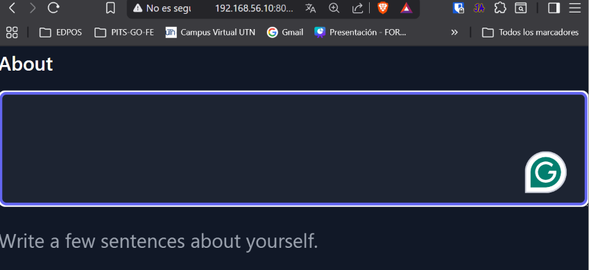
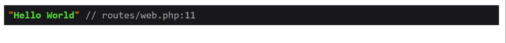
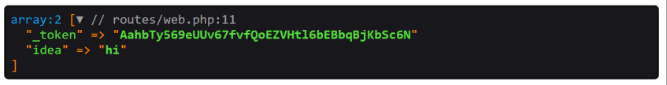
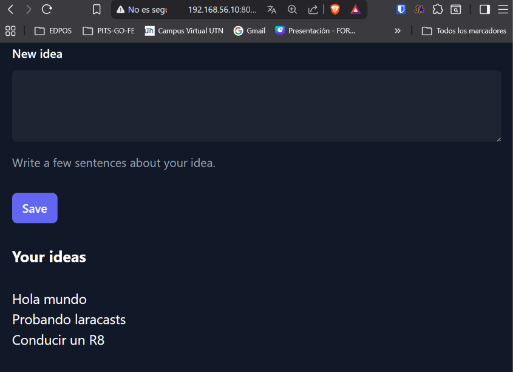

[< Volver al índice](../entregable01.md)

# Episodio 07: Forms

En este episodio trabajé con forms HTML conectados a rutas POST en Laravel y protegí esa peticiones con CSRF, además de como leer los datos enviados y mantenerlos temporalmente en la sesión.

Empecé con un formulario simple apuntando a una ruta que aún no existía:

```php
<form method="POST" action="/ideas">
    <textarea name="idea" id="idea" cols="30" rows="10"></textarea>
</form>
```

Le di estilo con Tailwind (cargado vía CDN en el layout) y agregué el botón de envío.

Un primer obstaculo: cualquier formulario que use `POST` necesita el token CSRF (Cross-Site Request Forgery) viajando como input oculto dentro del `<form>`. Blade lo genera con la directiva `@csrf`:

```php
<form method="POST" action="/ideas">
    @csrf
    <!-- resto del formulario -->
</form>
```

Para recibir los datos en la ruta, usé el helper `request()`, que puede traer todo el payload con `request()->all()` o un campo específico con `request('idea')`:

```php
Route::post('/ideas', function () {
    $idea = request('idea');

    session()->push('ideas', $idea);
    return redirect('/');
});
```

`session()->push()` en vez de sobrescribir el valor de `ideas` en la sesión, lo agrega como un nuevo elemento dentro de un array, bien para ir acumulando ideas sin perder las previas.

Del lado del GET, leí esa lista guardada y la pasé a la vista:

```php
Route::get('/', function () {
    $ideas = session()->get('ideas', []);

    return view('ideas', [
        'ideas' => $ideas,
    ]);
});
```

Y en la vista la recorrí con `@foreach`, mostrando la lista solo si hay contenido:

```php
@if (count($ideas))
    <div class="mt-6 text-white">
        <h2 class="font-bold text-lg text-white">Your ideas</h2>
        <ul class='mt-6'>
            @foreach ($ideas as $idea)
                <li class="text-small">{{ $idea }}</li>
            @endforeach
        </ul>
    </div>
@endif
```

También agregué una ruta auxiliar para limpiar la sesión durante el desarrollo:

```php
Route::get('/delete-ideas', function () {
    session()->forget('ideas');
    return redirect('/');
});
```

## Evidencia









<sub>Documentado por Xavier Fernández Zúñiga - ISW-811</sub>