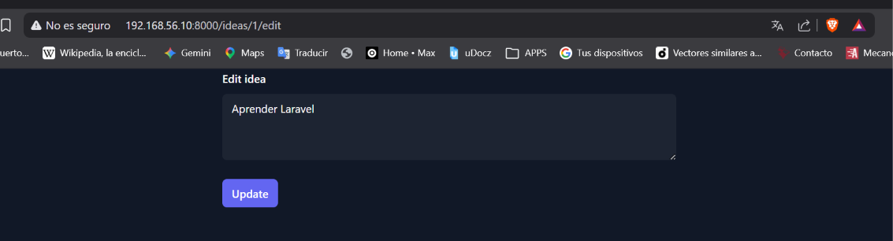
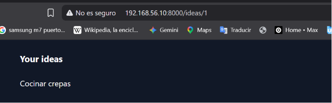
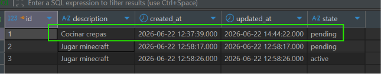
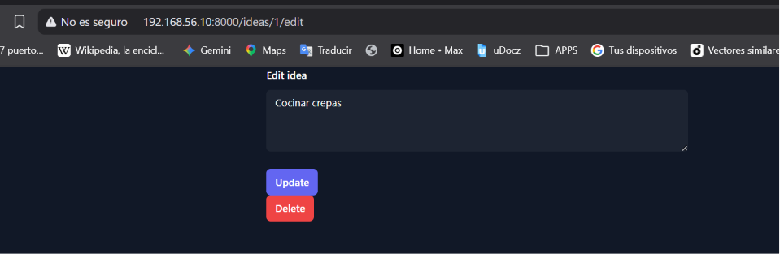

[< Volver al índice](../entregable01.md)

# Episodio 09: HTTP Requests and REST

En este episodio reorganicé las vistas de ideas siguiendo la convención RESTful que usa Laravel internamente, y agregué las acciones de ver, editar y eliminar una idea individual, además del listado y la creación que ya tenía.

Lo primero fue mover la vista de ideas a su propia carpeta, renombrando el archivo principal a `index`:

```
resources/views/ideas/
├── index.blade.php   (antes era ideas.blade.php)
├── show.blade.php
└── edit.blade.php
```

Esta es la misma convención de nombres que usan los controladores resource de Laravel (`index`, `show`, `edit`, `update`, `destroy`), aunque acá todavía no use un controlador — son closures directo en `web.php`.

Para la vista de una idea individual, usé Route Model Binding implícito, que resuelve automáticamente el modelo a partir del parámetro de la ruta siempre que el nombre del parámetro y el de la variable coincidan:

```php
Route::get('/ideas/{idea}', function (Idea $idea) {
    return view('ideas.show', [
        'idea' => $idea,
    ]);
});
```

Para editar, separé claramente la responsabilidad de cada verbo HTTP: el `GET` solo muestra el formulario precargado con los datos actuales, y el `PATCH` procesa el envío y actualiza:

```php
Route::get('/ideas/{idea}/edit', function (Idea $idea) {
    return view('ideas.edit', [
        'idea' => $idea,
    ]);
});

Route::patch('/ideas/{idea}/edit', function (Idea $idea) {
    $idea->update([
        'description' => request('description'),
    ]);
    return redirect('/ideas/' . $idea->id);
});
```

Como los formularios HTML normales solo soportan `GET` y `POST`, Laravel necesita la directiva `@method('PATCH')` para "falsificar" el verbo real dentro de un campo oculto:

```php
<form method="POST" action="/ideas/{{ $idea->id }}/edit">
    @csrf
    @method('PATCH')
    ...
</form>
```

Lo mismo aplica para eliminar, con `@method('DELETE')` en un formulario separado:

```php
<form method="POST" action="/ideas/{{ $idea->id }}">
    @csrf
    @method('DELETE')
    <button type="submit">Delete</button>
</form>
```

```php
Route::delete('/ideas/{idea}', function (Idea $idea) {
    $idea->delete();
    return redirect('/ideas');
});
```

Por último, conecté el listado del `index` con la vista `show`, convirtiendo cada idea en un enlace:

```php
<li><a href="/ideas/{{ $idea->id }}">{{ $idea->description }}</a></li>
```

## Evidencia









<sub>Documentado por Xavier Fernández Zúñiga - ISW-811</sub>