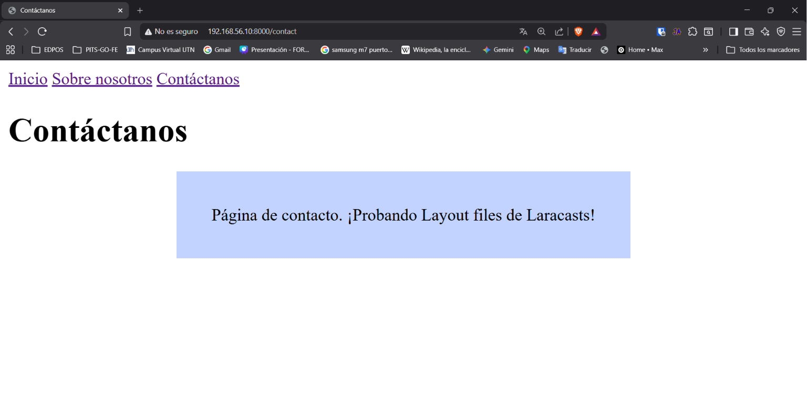
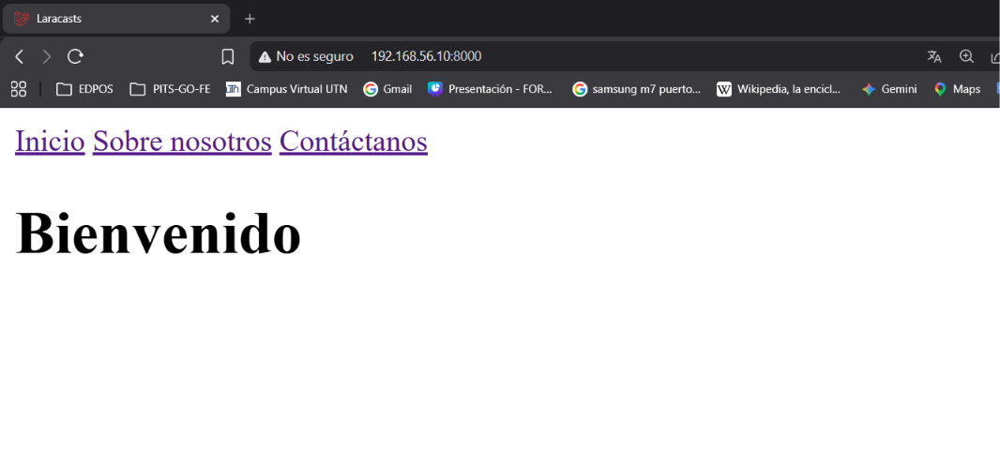
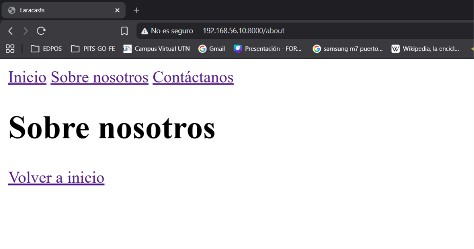

[< Volver al índice](../entregable01.md)

# Episodio 04: Layout Files

En este episodio aprendí a crear un componente de layout reutilizable en Laravel usando Blade Components, en lugar de repetir la estructura HTML completa en cada vista.

Creé una carpeta `components/` dentro de `resources/views/` con dos archivos:

**`layout.blade.php`** — el layout principal, que recibe un título dinámico mediante `@props` y muestra el contenido de cada página a través de `{{ $slot }}`:

```php
@props(['title' => 'Laracasts'])

<!DOCTYPE html>
<html lang="en">
<head>
    <meta charset="UTF-8">
    <meta name="viewport" content="width=device-width, initial-scale=1.0">
    <title>{{ $title }}</title>
    <style>
        .max-w-400 {
            max-width: 400px;
            margin: 0 auto;
        }

        .card {
            background: #c2d3ff;
            padding: 1rem;
            text-align: center;
        }
    </style>
</head>
<body>
    <nav>
        <a href="/">Inicio</a>
        <a href="/about">Sobre nosotros</a>
        <a href="/contact">Contáctanos</a>
    </nav>
    <main>
        {{ $slot }}
    </main>
</body>
</html>
```

**`card.blade.php`** — un componente reutilizable para tarjetas, que usa `$attributes->merge()` para permitir agregar clases CSS adicionales desde afuera del componente:

```php
<div {{ $attributes->merge(['class' => 'card']) }}>
    {{ $slot }}
</div>
```

Con estos dos componentes, las vistas quedan mas simples. Por ejemplo, `welcome.blade.php` se redujo a:

```php
<x-layout>
    <h1>Bienvenido</h1>
</x-layout>
```

Y creé una nueva página de contacto (`contact.blade.php`) usando ambos componentes juntos:

```php
<x-layout title="Contáctanos">
    <h1>Contáctanos</h1>
    <x-card class="max-w-400">
        <p>Página de contacto. ¡Probando Layout files de Laracasts!</p>
    </x-card>
</x-layout>
```

## Evidencia







## Comentarios 

Lo que más me gustó de este episodio fue entender cómo `$attributes->merge()` permite que un componente reciba clases adicionales desde donde se usa, sin perder sus estilos base.

<sub>Documentado por Xavier Fernández Zúñiga - ISW-811</sub>