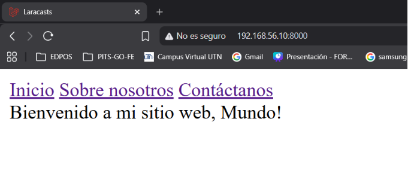
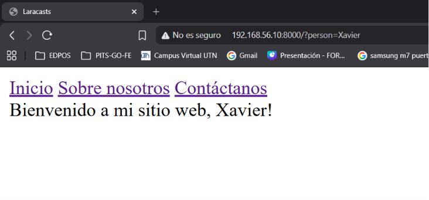

[< Volver al índice](../entregable01.md)

# Episodio 05: Pass Data to Views

En este episodio aprendí distintas formas de pasar datos desde una ruta hacia una vista en Laravel.

Primero probé la forma corta `Route::view()`, que permite pasar datos como tercer parametro sin necesidad de un closure:

```php
Route::view('/', 'welcome', [
    'greeting' => 'Bienvenido a mi sitio web',
]);
```

Luego volví a usar un closure con `Route::get()` para poder leer un parámetro de la URL usando el helper `request()`, con un valor por defecto en caso de que no se envíe:

```php
Route::get('/', function () {
    return view('welcome', [
        'greeting' => 'Bienvenido a mi sitio web',
        'person' => request('person', 'Mundo'),
    ]);
});
```

En la vista `welcome.blade.php` mostré ambas variables, usando dos sintaxis distintas de Blade:

```php
<x-layout>
    {{ $greeting }}, {!! $person !!}!
</x-layout>
```

La doble llave `{{ }}` escapa automáticamente el contenido para prevenir HTML/JS malicioso, mientras que `{!! !!}` lo imprime tal cual, sin escapar. Aprendí que `{!! !!}` se debe usar con mucho cuidado, solo cuando se confía completamente en la fuente del dato, ya que de lo contrario abre la puerta a ataques XSS segun mencinoa.

## Evidencia

Cuando no se envía el parámetro `person` por la URL, se usa el valor por defecto "Mundo":



Al visitar `http://192.168.56.10:8000/?person=Xavier`, el saludo cambia dinámicamente:



## Comentario

Me pareció muy interesante la diferencia práctica entre `{{ }}` y `{!! !!}`, así que ahora entiendo mejor por qué Blade escapa por defecto y por qué hay que ser explícito si se quiere lo contrario.

<sub>Documentado por Xavier Fernández Zúñiga - ISW-811</sub>