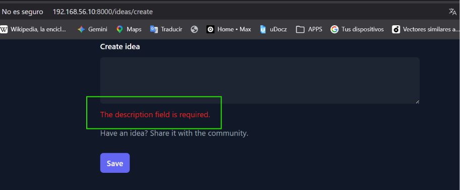
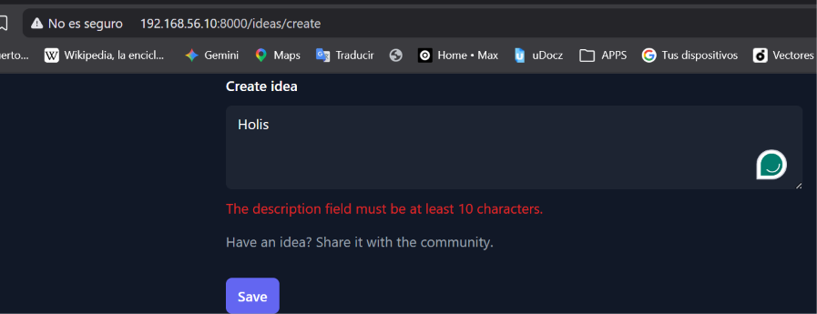

[< Volver al índice](../entregable01.md)

# Episodio 11: Request Validation

En este episodio agregué validación al formulario de creación de ideas, para evitar que se guarden descripciones vacías o demasiado cortas, y aprendí a mostrar los mensajes de error de forma reutilizable con un componente Blade.

El primer paso fue agregar las reglas de validación directamente en el método `store` del controlador, usando `validate()`:

```php
public function store(Request $request)
{
    request()->validate([
        'description' => ['required', 'min:10'],
    ]);

    Idea::create([
        'description' => request('description'),
        'state' => 'pending',
    ]);

    return redirect('/ideas');
}
```

`required` exige que el campo no venga vacío, y `min:10` exige un mínimo de caracteres. Si falla redirige de vuelta al formulario anterior, conservando los datos ingresados y guardando los errores en una variable `$errors` disponible en la vista, sin que yo tenga que manejar nada de eso manualmente.

Para mostrar el error, en vez de repetir la misma lógica en cada campo de cada formulario, armé un componente Blade reutilizable llamado `x-forms.error`, ubicado en `resources/views/components/forms/error.blade.php`:

```php
@props([
    'name' => 'required',
])
@error($name)
    <p class="mt-2 text-sm text-red-600" id="description-error">{{ $message }}</p>
@enderror
```

La directiva `@error($name)` revisa si el campo indicado tiene un error de validación, y si lo tiene, expone automáticamente una variable `$message` con el texto exacto generado por Laravel para esa regla específica — no tuve que escribir manualmente el mensaje de error.

Así se utilizó en el form_

```php
<textarea id="description" name="description" rows="3" ...></textarea>
<x-forms.error name="description" />
```

## Evidencia






<sub>Documentado por Xavier Fernández Zúñiga - ISW-811</sub>