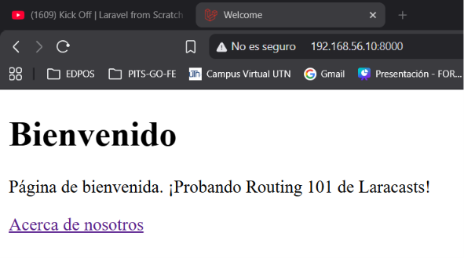
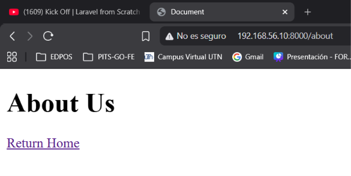
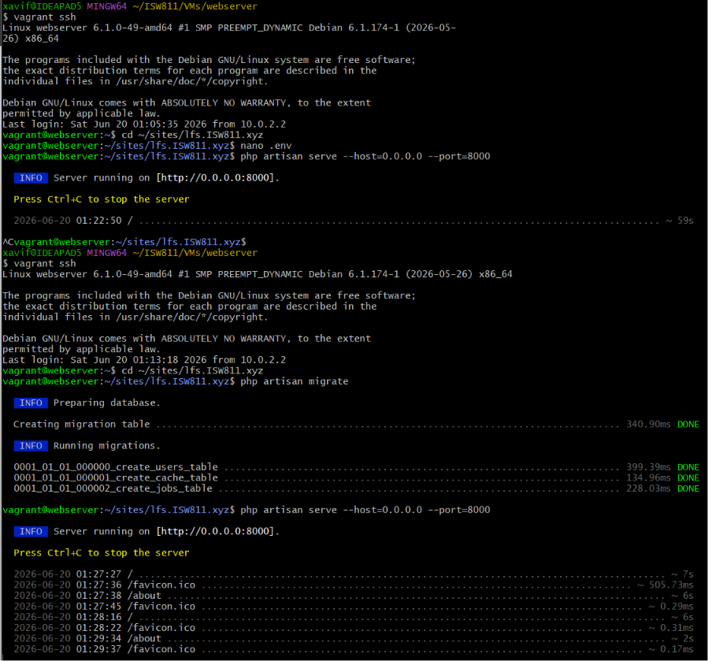

[< Volver al índice](../entregable01.md)

# Episodio 03: Routing 101

En Laravel las rutas se configuran en el archivo `routes/web.php`. Cada ruta puede retornar una vista, HTML directo, o incluso JSON.

En este episodio configuré dos rutas: la página principal (`/`) y una página "Acerca de nosotros" (`/about`), cada una retornando su propia vista Blade.

```php
Route::get('/', function () {
    return view('welcome');
});

Route::get('/about', function () {
    return view('about');
});
```

La vista `welcome.blade.php` la modifiqué para mostrar un mensaje de bienvenida con un enlace hacia `/about`, y la vista `about.blade.php` la creé desde cero con un enlace de regreso al inicio.





## Problema encontrado

Al levantar el proyecto con `php artisan serve` me apareció un error de conexión a la base de datos, ya que el `.env` traía las credenciales por defecto de Laravel (usuario `root`). Tuve que crear una base de datos y un usuario en MariaDB específicos para este proyecto y actualizar el `.env` con esas credenciales. Después apareció un segundo error porque la tabla `sessions` no existía, que se resolvió corriendo `php artisan migrate`.



---
<sub>Documentado por Xavier Fernández Zúñiga - ISW-811</sub>